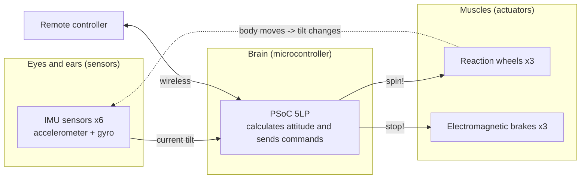

# Reference: information needed to build 🔧

This area collects material you can look back at when you are “actually building it.”
It is separated from the lessons (understanding) so you can look up **circuit structure, parts, and connections** in reverse.

> Source: Transistor Gijutsu (Transistor Technology) June 2020, short serial Part 1 (Shinji Mitani / JAXA, pp.121–127). All diagrams are redrawn by me.

## Table of contents

| File | Content | In one phrase |
|---|---|---|
| [`system-block.md`](./system-block.md) | Circuit structure (system block diagram) | **Overall wiring diagram**: how the brain, eyes, and muscles connect |
| [`parts-list.md`](./parts-list.md) | Parts list (BOM) | A list of **what you need and how many** |
| [`mechanical.md`](./mechanical.md) | Mechanical structure | **How to place the wheels and sensors** |
| [`interfaces.md`](./interfaces.md) | Signal interfaces | Roles of **I²C / UART / PWM / MOSFET / A-D** |

## Big picture (remember it as three part groups)

Attitude control is the loop of “**see with the eyes → think with the brain → move with the muscles → see again**,”
repeated hundreds of times per second (= **feedback control**).

➡️ For wiring details, go to [`system-block.md`](./system-block.md).
