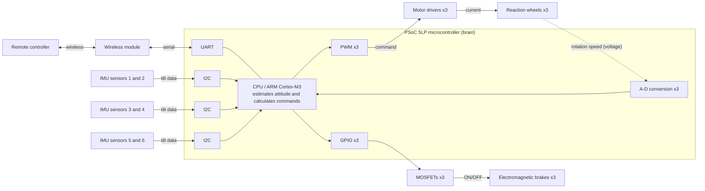
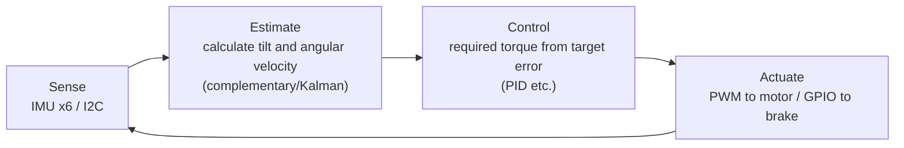

# Circuit structure (system block diagram)

This is a redrawn and explained version of the original article’s “Fig. 2 System block of the 3-axis attitude control module.”
The key point is that **almost all parts connect directly to one PSoC 5LP microcontroller** (= simple wiring).

---

## Overall wiring diagram

> **Meaning of x3**: the wheels, motors, brakes, PWM, and A-D are **three sets for the X, Y, and Z axes**.
> The diagram combines them into one representative line to make it easier to read (the real system has three parallel channels).

---

## Signal flow (three paths)

### ① Input: sensors → brain (“What is happening now?”)
- Six IMU sensors send data to the microcontroller over **I²C** (two-wire chat communication).
- The six sensors are split into three I²C buses, two sensors per bus (to avoid congestion).

### ② Output, spinning: brain → motor (“Change the orientation”)
- The microcontroller uses **PWM** (fast ON/OFF) to command the motor driver how much to spin.
- The motor driver sends **current** to the motor, and the reaction wheel spins.
- The wheel’s **rotation speed** returns from the motor driver as an **analog voltage**. The **A-D converter** changes it into numbers so the microcontroller can read it (= a guard against spinning too much).

### ③ Output, stopping: brain → brake (“Stop instantly and create a large force”)
- The microcontroller turns a **MOSFET** (electrical switch) ON using **GPIO**.
- The MOSFET sends electricity to the **electromagnetic brake**, stopping the spinning wheel in an instant.
- This “hard braking” changes the wheel’s rotational momentum into **standing-up force** all at once.

### ④ Communication: remote controller ⇄ brain
- Handheld remote controller ⇄ wireless module ⇄ **UART** ⇄ microcontroller.
- A person can send commands such as “stand up.”

---

## Why PSoC 5LP? (design goal)

| Reason | What it means |
|---|---|
| Real-time behavior is critical | If the control cycle timing jitters, attitude becomes unstable. → **FreeRTOS** (real-time OS) is used. |
| Many jobs at the same time | Sensor reading, communication, motor driving, control calculation, and more must be handled by one chip. |
| Circuits can be made by programming | PSoC’s **UDB** (flexible circuit blocks) can connect multiple sensors and motors flexibly. |

---

## 🔵 In depth: control loop and timing

> When you understand not only the “wiring (space)” but also the “flow of time,” it becomes clear why this system uses an RTOS.

### Control is a “fixed-period loop”
Attitude control is feedback control that repeats the following four steps **at a fixed period (for example, hundreds of Hz to kHz)**.

- If the time for one loop varies, the calculated “required torque” and the actual effect become mismatched, making the system **unstable**.
- That is why **accurate timing (real-time behavior)** is critical. **FreeRTOS** guarantees that “this process always runs at this period.”

### The “three parallel channels” structure
- Wheels, motors, brakes, PWM, and A-D are **three sets for X/Y/Z**. The three axes can be controlled **independently**.
- There are three I²C buses because the MPU-6050 has only two possible addresses (→ [`interfaces.md`](./interfaces.md)).
  Be careful: the “three I²C buses for sensors” and the “three actuator sets” are **different threes**.

### Why gather everything into one microcontroller?
- To run sensor reading, estimation, control calculation, PWM generation, A-D, and communication on **the same time base**, it is safest to manage everything with one chip.
- PSoC can “grow” as many peripherals such as PWM and counters as needed using **UDB** (flexible circuit blocks). That is why one chip can cover three channels x several kinds of input/output.

---

## Questions this circuit answers when building

- **What does it measure?** → Tilt (six IMUs / I²C)
- **How does it move?** → Spin wheels (PWM → driver → motor) + stop them (GPIO → MOSFET → electromagnetic brake)
- **How does it avoid over-spinning?** → Reads rotation speed with A-D and monitors it
- **How does a person operate it?** → Wireless → UART

📎 For the parts list, see [`parts-list.md`](./parts-list.md). For detailed explanations of each communication method, see [`interfaces.md`](./interfaces.md).
