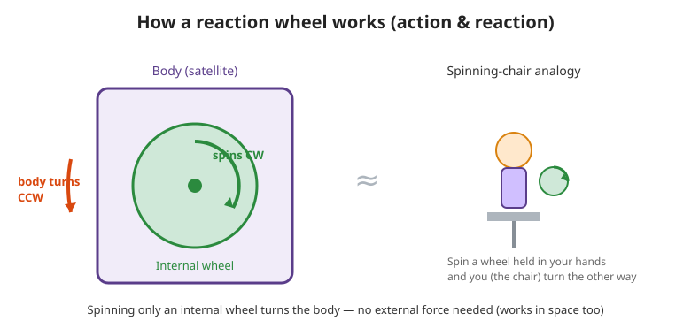

# 3. How to change direction in space (the most interesting part)

## The question: in space, there is nothing to “grab”

On the ground, changing direction is easy. You can kick the ground with your feet or push a wall with your hands.
But space is a **vacuum, with no ground or wall to grab**.

So how can you change direction? There are two main methods.

---

## Method A: spray gas (thruster / RCS)

Like a rocket, the spacecraft **sprays gas** and turns using the reaction.
- ✅ It can create strong force
- ❌ Once the gas (fuel) is used up, it is over. Not suitable for small devices.

---

## Method B: spin a “flywheel” inside (reaction wheel) ⭐️

This is the star of this lesson. It is a magical-looking method that **does not need fuel**.

### Try it with a swivel chair
Sit on a rotating chair, hold a heavy wheel (or dumbbell), and **spin the wheel to the right**.
Then you (and the chair) will **rotate to the left**. Strange, right?



This is not magic. It is a **law of physics**.

### The key: “angular momentum (rotational momentum) does not increase or decrease by itself”

- **Angular momentum** = “rotational momentum.” It is larger when something heavy spins fast.
- If no outside force acts, **the total rotational momentum of the whole system does not change** (= **law of conservation of angular momentum**).

At first, nobody is rotating (total momentum = zero).
When you **spin the wheel to the right**, the body must rotate to the left
so the total momentum stays zero (positive and negative cancel).

> 🧠 In short: **just spinning an internal wheel can change the body’s orientation without outside force.**
> Perfect for spacecraft!

---

## A combined trick: “spin” and “stop”

What makes JAXA’s module amazing is that it also has **electromagnetic brakes**.

- If the motor only spins the wheel slowly, the force it can make is weak.
- So the wheel is **spun at high speed first, then stopped instantly with an electromagnetic brake**.
- Then the stored rotational momentum turns **all at once into a big force (torque)**,
  strong enough to **stand up from a lying position** against gravity.

> Analogy: if you spin a toy top hard and then suddenly stop it with your finger, you feel a sharp “thud” reaction in your hand. This uses that kind of reaction.

---

## A small weakness: unloading

If a wheel keeps spinning in the same direction, it eventually **gets too fast and reaches its limit** (it cannot accelerate more).
At that point, another method must apply force to the body and **return the wheel rotation**.
This is called **unloading**. (More in Lesson 3.)

---

## 🔵 In depth: physics of angular momentum and torque

> From here on, this is for readers who want a little more. We check “why it rotates” using middle-school-plus physics formulas.
> If it feels difficult, it is OK to read only the 🧠 summary boxes.

> 📌 **About numbering**: The article numbers its equations continuously — roughly **Part 1 (overview) = Eqs. 1–8, Part 2 (this chapter) = Eqs. 9–, Part 3 = Eqs. 36–42**. In this note we label Part 1’s rotational physics as **Foundational Eqs. (1)–(6)** and, at the end, show how they connect to **Eqs. 9 and 10** in Session 2 (not a one-to-one match with the article’s numbers).

### 1) Angular momentum L = Iω —— what rotational “momentum” really is
Rotational momentum can be written with this simple formula. (**Foundational Eq. 1**)

```math
L = I\,\omega
```

- $`I`$: **moment of inertia** (= how hard it is to rotate). It is larger when the object is heavier and when its mass is farther from the rotation axis (toward the outside). Unit: kg·m²
- $`\omega`$ (omega): **angular velocity** (how many radians it turns per second). Unit: rad/s

The feeling that “a heavy wheel spinning fast has more momentum” is just the multiplication of **weight/shape ($`I`$) × speed ($`\omega`$)**.

### 2) Conservation of angular momentum —— the total does not change by itself
If there is no external torque (twisting force), the total $`L`$ of the system is constant. If everything starts at rest, the total is zero, so (**Foundational Eq. 2**):

```math
I_{\text{body}}\,\Omega_{\text{body}} + I_{\text{wheel}}\,\omega_{\text{wheel}} = 0
```

```math
\Rightarrow\quad \Omega_{\text{body}} = -\frac{I_{\text{wheel}}}{I_{\text{body}}}\,\omega_{\text{wheel}}
```

- If the wheel spins in the positive direction ($`\omega_{\text{wheel}}>0`$), the body rotates in the negative direction ($`\Omega_{\text{body}}<0`$). This is exactly the swivel-chair experiment.
- The body is heavy ($`I_{\text{body}}`$ large), and the wheel is light ($`I_{\text{wheel}}`$ small). So the body rotates slowly while the wheel rotates fast.

### 3) “Changing orientation” = producing torque = “accelerating” the wheel
To **change** orientation, torque $`\tau`$ (tau) is needed. Torque is the rate of change of angular momentum. (**Foundational Eq. 3**: Newton for rotation)

```math
\tau = \frac{dL}{dt} = I\,\frac{d\omega}{dt} = I\,\dot{\omega}
```

The motor applies torque $`\tau_w = I_{\text{wheel}}\,\dot{\omega}_{\text{wheel}}`$ to the wheel.
By action-reaction (Newton’s third law), the body receives the opposite torque $`-\tau_w`$. (**Foundational Eq. 4**)

```math
\dot{\Omega}_{\text{body}} = -\frac{\tau_w}{I_{\text{body}}}
```

> 🧠 **Most important point**: the body rotates (torque appears) only while the wheel is **accelerating or decelerating**.
> If it keeps spinning at a constant speed, torque is zero (it is only “storing” momentum).
> That is why control is done by **raising and lowering the wheel speed**.

### 4) Why an electromagnetic brake? —— saturation and large torque
- The wheel speed $`\omega_{\text{wheel}}`$ has an upper limit. If it keeps increasing, it eventually hits the limit = **momentum saturation**.
- The motor’s continuous torque is small (about $`55\,\text{mNm}`$ for the maxon EC 45 flat). Slow acceleration gives weak force.
- So the system **stores energy by spinning at high speed** (kinetic energy $`E=\tfrac12 I_{\text{wheel}}\,\omega^2`$, **Foundational Eq. 5**), then **stops it all at once with the brake over a short time $`\Delta t`$**. Because angular momentum $`\Delta L`$ is released in a short time (next formula, **Foundational Eq. 6**),

```math
\tau_{\text{brake}} = \frac{\Delta L}{\Delta t}\ \gg\ \tau_{\text{motor}}
```

The smaller $`\Delta t`$ is, the larger the momentary torque becomes. This is the true source of the large torque that “stands up from a lying position” (we calculate actual numbers in Lesson 3).

### 5) Physics of unloading
To return a saturated wheel, the wheel is slowed while applying **external torque** to the body.
- Ground experiment: table friction or a hand gives external torque.
- Space: a **magnetic torquer** (using Earth’s magnetic field) or **thrusters** are used.
A good image is “letting excess angular momentum escape outside the system.”

### ⭐ Foundational Eqs. →　Session 2’s Eqs. 9 and 10 (the link)

Session 2’s equations of motion are just **Foundational Eq. 3 $`\tau=I\dot\omega`$ (Newton for rotation) written once for the wheel and once for the body**, plus gravity, friction, and the motor:

- **Wheel**: absolute angular acceleration $`(\ddot\theta_b+\ddot\theta_w)`$ × inertia $`I_w`$ = motor $`T_m`$ − bearing friction $`C_w\dot\theta_w`$ → **Eq. 9**.
- **Body**: about the pivot, gravity torque $`(m_b l_b+m_w l)\,g\,\sin\theta_b`$ + the wheel’s reaction (**Foundational Eq. 4**) − friction → **Eq. 10**.

> 🧠 So **Foundational Eqs. (1)–(6) (article Part 1) → Eqs. 9 and 10 (Session 2)** are one continuous story: Part 1 gives “words + foundational formulas,” Part 2 gives the “finished equations of motion.” The from-scratch derivation of Eqs. 9 and 10 is in [Session 2 “Modeling”](../session-2-modeling/02-modeling.md).

---

### ✅ Quick check
- What are the strengths and weaknesses of thrusters and reaction wheels? (easy)
- Explain the “law of conservation of angular momentum” using the swivel-chair example. (easy)
- Why can an electromagnetic brake create a large force? (easy)
- 🔵 Use $`\tau = I\dot\omega`$ to explain why “the body rotates only while the wheel is **accelerating**.”
- 🔵 From $`\Omega_{\text{body}} = -\frac{I_{\text{wheel}}}{I_{\text{body}}}\omega_{\text{wheel}}`$, if you want the body to rotate slowly but by a large amount, should the wheel’s $`I`$ be larger or smaller?

➡️ Next: [4. Introducing the JAXA module](./04-jaxa-module.md)
