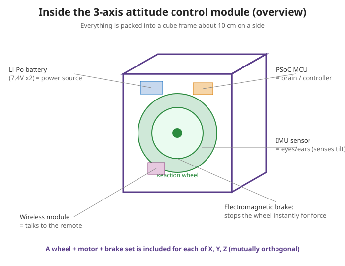
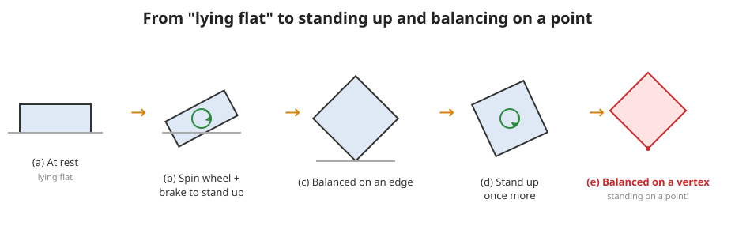

# 4. Introducing JAXA’s 3-axis attitude control module

Now it is time to introduce the main device. The article’s star is this 👇

> A device that packs **everything needed for attitude control** into a cube with side length about **10 cm**.
> Its goals are **small size, light weight, high density, and low cost**. It can **demonstrate 3-axis control** for artificial satellites on the ground.

---

## The “three tricks” this device can do

According to the article, it has the following three functions.

| Trick | Name | Motion | Difficulty |
|---|---|---|---|
| ① | Balancing on an edge | Balances while standing on **one edge** | 1D inverted pendulum |
| ② | Standing up | **Gets up by itself from a lying position** (a special trick of this device) | — |
| ③ | Balancing on a vertex | Keeps standing on **one point (vertex)** | 3D inverted pendulum |

Function ② is not something real artificial satellites need. It is a feature only for this teaching device.
It works because the device has an **electromagnetic brake** that can create a large momentary force.

---

## What does “standing on a point” mean? (inverted pendulum)

An **inverted pendulum** is like the game of **balancing a broom on your palm**.
The challenge is to keep something upright even though it wants to fall, by moving the bottom little by little.

This cube’s goal is to stand on a vertex (a point).
Standing on a point is extremely unstable → but it keeps standing by using **three-axis wheels to constantly cancel the direction it is about to fall**.

Flow in the figure above:
- **(a) At rest**: lying down
- **(b) Standing up**: spin a wheel and brake suddenly → the reaction lifts it up
- **(c) Balancing on one edge**: balances on an edge
- **(d) Stands up one more time**
- **(e) Balancing on a vertex**: finally standing on a point! 🎉

---

## Why a “cube” and “3 axes”?

- A cube has **three orthogonal faces** → mount one wheel on each face, for three wheels total.
- The three wheels handle the **X, Y, and Z axes** → the system can handle **any falling direction**.
- Batteries and boards are packed into the gaps to make it compact with no wasted space.

This is exactly a real example of **“3-axis attitude control.”** It is a ground miniature of what artificial satellites do in space.

---

## 🔵 In depth: unstable equilibrium and the physics of standing up

> Why are “standing on a point” and “standing up” difficult, and why can this mechanism achieve them?

### “Standing on a point” is unstable equilibrium
- A ball at the bottom of a valley **comes back** even if it shifts a little (stable equilibrium).
- A ball on top of a mountain, or a pencil standing on its tip, **falls farther and farther** even with a tiny shift (unstable equilibrium). An inverted pendulum is this kind.
- Unstable equilibrium can **never be maintained if left alone**. That is why **fast feedback** (measure → correct) is essential, and the wheels keep producing torque ahead of the falling direction.

### Standing up: why does it need “sudden braking”? (thinking with numbers)
To lift the center of gravity from a lying position, the system must beat the torque that gravity uses to pull it back. When the tilt is $\theta$, the gravitational torque on the center of gravity is:

$$ \tau_{\text{gravity}} = m\,g\,l\,\sin\theta $$

- Example: if $m=1\,\text{kg}$, $g=9.8\,\text{m/s}^2$, $l=0.07\,\text{m}$, and $\theta=45^\circ$,
  $\tau_{\text{gravity}} \approx 1 \times 9.8 \times 0.07 \times 0.707 \approx 0.48\,\text{N·m}$.
- This is about **8 to 9 times** the motor’s continuous torque (about $0.055\,\text{N·m}$). Slowly spinning the motor is nowhere near enough.
- So the system **stores momentum with high-speed rotation and releases it all at once using the electromagnetic brake**, creating a large momentary torque (→ the formula in 03, $\tau_{\text{brake}}=\Delta L/\Delta t$). Detailed calculation is in Lesson 3.

> 🧠 Summary: ① Balancing on a point is unstable → maintained by high-speed feedback. ② Standing up must beat gravitational torque → uses the brake’s large momentary torque.

---

### ✅ Quick check
- Can you name the device’s “three tricks”? (easy)
- What everyday game is an inverted pendulum like? (easy)
- Why is the cube shape convenient for 3-axis control? (easy)
- 🔵 Explain the difference between “stable equilibrium” and “unstable equilibrium” using a ball as an example.
- 🔵 Why is slow motor rotation alone not enough to stand up? Explain using the formula.

➡️ Next: [5. Quick overview of the parts](./05-parts-overview.md)
