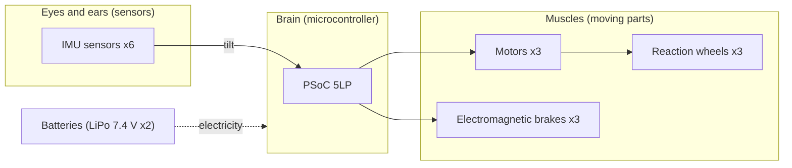

# 5. Quick overview of the parts (eyes, brain, and muscles)

The device contains many parts,
but it becomes much easier to understand if you split them into three groups: **“eyes, brain, and muscles.”**



---

## 👀 Eyes and ears: sensors

| Part | Role | In one phrase |
|---|---|---|
| **IMU sensors x6** | Sense tilt and motion | A set of an “accelerometer” and a “gyro.” Six sensors make it accurate. |

- **Accelerometer**: senses which way is down (gravity). → Good at slow tilt.
- **Gyro**: senses rotational speed. → Good at fast motion.
- Combining the two makes both slow and fast motion accurate (the main topic of Lesson 2).

## 🧠 Brain: microcontroller

| Part | Role | In one phrase |
|---|---|---|
| **PSoC 5LP** | Command center for the whole system | Reads sensors, calculates, and commands the motors. Its special feature is that circuits can be made by programming. |

- Attitude control depends heavily on **timing**, so a **real-time OS (FreeRTOS)** keeps an accurate rhythm.

## 💪 Muscles: moving parts (actuators)

| Part | Role | In one phrase |
|---|---|---|
| **Motors x3** | Spin the wheels | maxon brushless motors (30 W). |
| **Reaction wheels x3** | Spin and change the body’s orientation | One for each of the X/Y/Z axes. |
| **Electromagnetic brakes x3** | Stop instantly and create large force | The special move for “standing up.” |

## 🔌 Other parts

| Part | Role |
|---|---|
| **Wireless module** | Communicates with the handheld remote controller |
| **Lithium polymer batteries x2** | Electrical supply source (7.4 V x2) |
| **Cube frame** | Frame that holds everything (side length about 10 cm) |

---

## Summary: map of this chapter

```
👀 Eyes (IMUs x6) → 🧠 Brain (PSoC) → 💪 Muscles (motor → wheel / brake) x3 axes
                     ↑______________ Check again with the eyes (repeat)
```

- **Lesson 2** looks closely at the 👀 “eyes” = sensors (how it “knows” its own tilt)
- **Lesson 3** looks closely at the 💪 “muscles” = wheels, brakes, motors, and control (how it “moves”)

Detailed parts information for building is in [`reference/parts-list.md`](../reference/parts-list.md),
and wiring is summarized in [`reference/system-block.md`](../reference/system-block.md).

---

## 🔵 In depth: what physical quantity each part “touches”

If you look at each part by “what physical quantity it reads or changes,” the whole device starts to look like one computer.

| Part | Quantity it directly handles | Related formula / keyword |
|---|---|---|
| Accelerometer | Gravity / translational acceleration | Direction of gravity → tilt angle |
| Gyro | Angular velocity $`\omega`$ | Angle by integration (but drift occurs) |
| Reaction wheel | Angular momentum $`L=I\omega`$ | $`\tau=I\dot\omega`$ (torque by acceleration) |
| Electromagnetic brake | Sudden release of angular momentum | $`\tau=\Delta L/\Delta t`$ |
| Motor / driver | Current → torque | $`\tau=k_t I`$ ($`k_t\approx 25.5\,\text{mNm/A}`$) |
| Hall sensor + pulse counting | Monitoring rotation speed | Saturation detection → unloading |

> 🧠 “Sensors = read quantities,” “actuators = change quantities,” and “microcontroller = decides the next quantity from the quantities it read.”
> This role split leads into Lesson 2 (read) and Lesson 3 (change).

---

### ✅ Quick check
- Sort the parts into “eyes, brain, and muscles.” (easy)
- What are accelerometers and gyros each good at? (easy)
- Why are many parts “x3”? (easy)
- 🔵 What physical quantities do the reaction wheel and motor each “handle”?

➡️ Test your knowledge! [`quiz.md`](./quiz.md)
