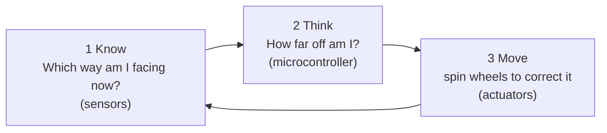
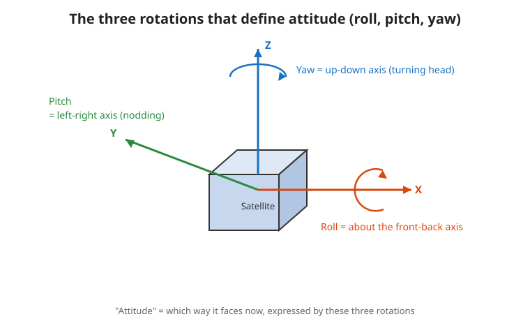

# Lesson Session 1: Big picture and basic concepts 🛰️

Welcome! Here, we learn **“What is 3-axis attitude control in the first place?”** without difficult formulas,
mainly through images and analogies. This is today’s goal 👇

## 🎯 Goals for this session
- [ ] Explain what “attitude” and “3 axes (XYZ)” mean
- [ ] Say why artificial satellites need attitude control
- [ ] Understand how to change direction in space (even when there is nothing to grab)
- [ ] Explain what JAXA’s 3-axis attitude control module does
- [ ] Sort the module’s parts into “eyes, brain, and muscles”

---

## 🟢🔵 How to read these notes (two levels)

Each page is written in **two stages**. Choose based on your goal.

- **🟢 Easy** … Mostly analogies that even a middle school student can understand. If you read only this, you will get the big picture.
- **🔵 In depth** … For readers who want a little more. Explains **“why it works”** using physics formulas and electrical ideas. If it feels hard, you can skip it.

> If you want to understand the mechanism carefully, read through the 🔵 parts. If you first want to grasp the flow, read only the 🟢 parts.

---

## 📖 Reading order

| No. | File | Content | Analogy |
|---|---|---|---|
| 1 | [`01-what-is-attitude.md`](./01-what-is-attitude.md) | Attitude, XYZ axes, roll/pitch/yaw | Expressing “direction” with numbers |
| 2 | [`02-why-needed.md`](./02-why-needed.md) | Why attitude control is needed | Pointing antennas, solar panels, and cameras |
| 3 | [`03-how-to-turn-in-space.md`](./03-how-to-turn-in-space.md) | How to turn in space | The magic of a swivel chair |
| 4 | [`04-jaxa-module.md`](./04-jaxa-module.md) | Introducing the JAXA module | A cube that stands on a point |
| 5 | [`05-parts-overview.md`](./05-parts-overview.md) | Quick overview of parts | Eyes, brain, and muscles |
| ✔️ | [`quiz.md`](./quiz.md) | Understanding check | Test your strength |

---

## 🧩 One-page summary for this session

Attitude control is this **repeating** three-step cycle.

> This loop runs hundreds of times per second, correcting little by little before the body falls.
> That is why it can stand even on a tiny point.

---

## 💡 Keywords for this session (details in the text and [glossary](../GLOSSARY.md))
Attitude / 3-axis / roll, pitch, yaw / torque / inertia / reaction wheel / angular momentum / inverted pendulum

Next time 👉 [Lesson Session 2: Equations of motion and microcontroller control](../session-2-modeling/README.md) (turning motion into equations to control it)
