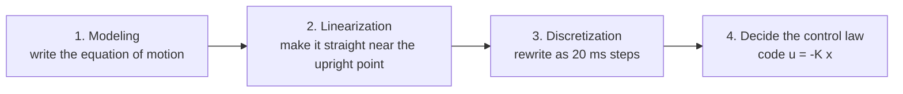

# 1. Four steps for making a control program

## First, the big picture: what happens inside the microcontroller?

Remember the **system block diagram** we saw at the end of Session 1.
The flow was sensors (eyes) -> microcontroller (brain) -> motor driver (muscles) -> wheel.

This session is about the **inside of the microcontroller (brain)**: how to calculate and recover from falling.
That program is built in the following **four steps**.

---

## 🟢 Easy: like a cooking recipe

You cannot suddenly write a “control program that does not fall over.” You prepare it step by step.

1. **Modeling (Step 1)** … Turn the rule for “how this object moves” into equations.
   -> *The stage where you learn the ingredients and what happens when you heat them.*
2. **Linearization (Step 2)** … The rule is a little complex (curved), so you look **only near the upright point** and rewrite it as a straight-line equation.
   -> *The stage where you simplify the recipe for a normal home stove.*
3. **Discretization (Step 3)** … The microcontroller does not run continuously; it runs **every 20 ms**, so you rewrite the equations to match that timing.
   -> *The stage where you divide time into steps, like “stir every 3 minutes.”*
4. **Decide the control law (Step 4)** … Make a rule that looks at “how much it is tilted now” and decides “how much current to send to the motor,” then **write it in the program**.
   -> *The stage where you taste the food and decide the heat level.*

> 🧠 The important thing is the order: **1) know the motion -> 2) and 3) rewrite it into an easier form -> 4) decide how to move it**.
> This flow is the same not only for inverted pendulums, but also for robot arms and drones.

---

## 🔵 In depth: why these four steps?

- **Step 1 (modeling)**: Turn real motion into an **equation of motion** (differential equation) from Newton’s laws. This is the “blueprint” of control. If the equation is wrong, everything after it shifts out of place.
- **Step 2 (linearization)**: The equation of motion contains **nonlinear** terms such as $`\sin\theta_b`$. If it stays nonlinear, design theory used later (such as LQR) cannot be applied directly, so we use a **Taylor expansion around the upright point**, approximate to first order, and make a **linear state-space model** $`\dot{\mathbf{x}} = A\mathbf{x} + Bu`$.
- **Step 3 (discretization)**: A microcontroller cannot integrate in continuous time. We convert it into a **discrete-time model** that updates at a fixed period $`\Delta t`$ (here, $`20\,\text{ms}`$): $`\mathbf{x}[k+1] = A_d\mathbf{x}[k] + B_d u[k]`$.
- **Step 4 (control law)**: For the discrete model, design the **state feedback** $`u[k] = -K_d\,\mathbf{x}[k]`$ gain $`K_d`$ and implement it in C or another language.

> 🧠 Steps 2 and 3 are the work of “translating reality into a form that the microcontroller and control theory can handle.”
> Much of the difficulty is in this translation. The implementation in Step 4 itself is only a few multiplications and additions.

---

### ✅ Quick check
- Can you say the four steps for making a control program in order? (easy)
- Why are “linearization” and “discretization” needed? (easy / 🔵)

➡️ Next: [2. Modeling (writing the equation of motion)](./02-modeling.md)
