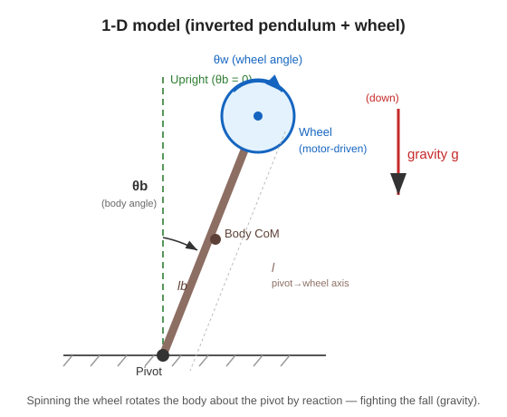

# 2. Modeling (writing the equation of motion)

## Think with a 1-D model

Jumping straight into 3D is hard, so in Session 2 we think with a **1-D model (falling around only one axis in a plane)**.
It is like “a rod standing on a point (an inverted pendulum), with a flywheel attached near the top.”

- **Body** (brown rod) … The main body trying to stand on the support point (pivot). Angle $\theta_b$.
- **Wheel** (blue circle) … A flywheel spun by the motor. Angle $\theta_w$.
- **Upright point** (green dotted line) … The straight-standing state. $\theta_b = 0$. This is where we want to keep it.
- **Gravity g** … Tries to make the body fall.

---

## 🟢 Easy: only three “forces” appear

Only three forces (effects) decide whether this rod falls or stands.

1. **Gravity** … The more it tilts, the harder gravity tries to make it fall. (The farther it is from the upright point, the easier it falls.)
2. **Motor force (torque)** … Spins the wheel. By reaction, it also works in the direction that raises the body. ← The “swivel chair” from Session 1!
3. **Friction** … A nuisance that brakes rotation. It exists at both the body axis and the wheel axis.

> 🧠 Modeling means putting the balance of these “force that makes it fall, force that raises it, and force that gets in the way” into **one equation**.
> Once we have an equation, the microcontroller can calculate and predict “which way and how much it will move now.”

---

## 🔵 In depth: equation of motion

We write Newton’s equation of motion for rotation (torque = moment of inertia × angular acceleration) for the body and the wheel.

**For the wheel (article Eq. 9)**

$$ I_w\left(\ddot{\theta}_b + \ddot{\theta}_w\right) = T_m - C_w\,\dot{\theta}_w $$

**For the body (article Eq. 10)**

$$ \ddot{\theta}_b = \frac{(m_b l_b + m_w l)\,g\,\sin\theta_b \;-\; T_m \;-\; C_b\,\dot{\theta}_b \;+\; C_w\,\dot{\theta}_w}{I_b + m_w l^2} $$

Meaning of the symbols:

| Symbol | Meaning |
|---|---|
| $\theta_b,\ \theta_w$ | Body angle and wheel angle |
| $I_b,\ I_w$ | Moments of inertia of the body and wheel (how hard they are to rotate) |
| $m_b,\ m_w$ | Masses of the body and wheel |
| $l_b$ | Distance from the support point to the body center of mass |
| $l$ | Distance from the support point to the wheel axis |
| $C_b,\ C_w$ | **Friction (rotational viscosity) coefficients** of the body axis and wheel axis |
| $T_m$ | Torque produced by the motor |
| $g$ | Gravitational acceleration |

**Motor torque (article Eq. 12)** is proportional to the current $u$.

$$ T_m = K_m\,u $$

- $K_m$: **torque constant** [Nm/A]. How many Nm of torque are produced per 1 A of current (-> glossary).
- In other words, **the only thing the microcontroller can operate is the current $u$**. This becomes the “input” from here on.

> 🧠 Looking at the numerator, the $g\sin\theta_b$ term (gravity making it fall) and the $-T_m$ term (motor raising it) appear with opposite signs.
> It is a tug-of-war between the “falling force” and the “raising force.” The goal of control is to keep this at $\theta_b=0$.

### Why $\sin\theta_b$?
Gravity’s “twisting force (torque)” that tries to make the body fall is stronger when the tilt $\theta_b$ is larger, and zero when it is straight ($\theta_b=0$). This relationship appears as $\sin\theta_b$. This $\sin$ becomes a problem on the next page.

---

### ✅ Quick check
- What are the three “forces” that decide this rod’s motion? (easy)
- 🔵 In the numerator of Eq. (10), which term points in the “falling” direction and which term points in the “raising” direction?
- 🔵 What quantity (input) can the microcontroller directly change? Why is it current?

➡️ Next: [3. Linearization (turning a curve into a line)](./03-linearization.md)
