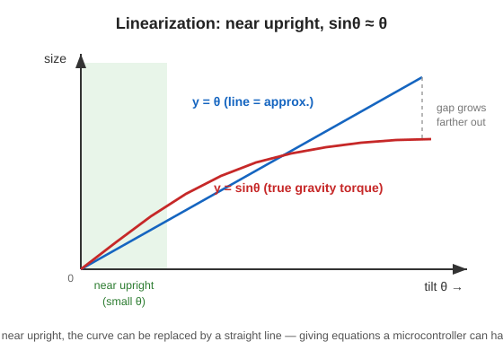

# 3. Linearization (turning a curve into a line)

## Problem: $`\sin\theta_b`$ is hard to handle

The equation of motion on the previous page contained $`\sin\theta_b`$.
When this $`\sin`$ (a curve) is present, the control design theory we use later cannot be applied as-is.
So we look **only near the upright point ($`\theta_b=0`$)** and replace the curve with a **straight line**. This is **linearization**.



---

## 🟢 Easy: if you look only nearby, a slope is straight

Earth is round (curved), but if you look only near your feet, the ground looks **flat**, right?
In the same way, if we consider only **very near the upright point**, the $`\sin`$ curve can be treated as a **straight line**.

- In the green band in the figure (near the upright point, where the tilt is small), the red curve (real motion) and the blue line (approximation) almost **overlap perfectly**.
- But the farther you get from the upright point, the more the two differ.

> 🧠 So this control assumes that it will **keep making small corrections near the upright point**.
> A state that has fallen far over cannot be handled accurately by this equation (that is handled separately by the “standing up” column in Session 2).

Near the upright point, we replace it like this:

```math
\sin\theta_b \;\approx\; \theta_b
```

(= “turning a curve into a line.” This is one of the most famous examples of approximation.)

---

## 🔵 In depth: Taylor expansion and the state-space model

Using a **Taylor expansion** around the upright point $`\theta_b=0`$ and throwing away second-order and higher small terms gives

```math
\sin\theta_b = \theta_b - \frac{\theta_b^3}{6} + \cdots \;\approx\; \theta_b
```

Now the equation of motion becomes **linear**. Next, we prepare a **state variable vector** that collects the state.

```math
\mathbf{x} = \begin{pmatrix} \theta_b \\ \dot{\theta}_b \\ \dot{\theta}_w \end{pmatrix} \quad(\text{body angle, body ang. velocity, wheel ang. velocity})
```

Then the equation of motion can be collected into this form, called a **state-space model** (article Eq. 13).

```math
\dot{\mathbf{x}} = A\,\mathbf{x} + B\,u
```

- $`A`$: **system matrix** (3×3). It represents how the object itself moves (what happens if it is left alone).
- $`B`$: **input matrix**. It represents how the current $`u`$ acts on the system.
- The contents of $`A,\ B`$ are determined by the part values ($`m,\ I,\ C,\ l`$, etc.). Here, we only need to understand the **form (structure)**. For example, the first row is the obvious relation “$`\dot{\theta}_b`$ is the second state itself,” so

```math
\text{first row of } A = \begin{pmatrix} 0 & 1 & 0 \end{pmatrix}
```

> 🧠 $`\dot{\mathbf{x}} = A\mathbf{x} + Bu`$ means “**if the current state $`\mathbf{x}`$ and input $`u`$ are known, the change at the next instant $`\dot{\mathbf{x}}`$ is determined**.”
> Once we get this form, stability checks and gain design can proceed using **only matrix calculations**. That is the reward for linearization.

(The concrete numerical values of $`A,\ B`$ come after the parts are fixed. For now, it is enough to understand the flow of “rewrite as a linear state-space model.”)

---

### ✅ Quick check
- What is the “Earth is round, but the ground near your feet is flat” analogy for? (easy)
- Why is this approximation bad far from the upright point? (easy)
- 🔵 What are the three contents of the state variable vector $`\mathbf{x}`$?
- 🔵 In $`\dot{\mathbf{x}} = A\mathbf{x} + Bu`$, what do $`A`$ and $`B`$ represent?

➡️ Next: [4. Discretization (rewriting as 20 ms steps)](./04-discretization.md)
