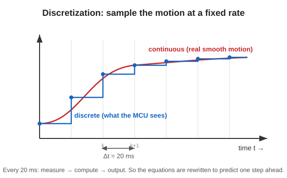

# 4. Discretization (rewriting as 20 ms steps)

## Problem: the microcontroller cannot calculate “continuously”

The previous page’s $`\dot{\mathbf{x}} = A\mathbf{x} + Bu`$ is a **continuous-time** equation (time flows smoothly).
But a microcontroller only repeats “measure -> calculate -> output” at fixed intervals.
So we rewrite the equation to match that step size $`\Delta t`$ (here, **20 ms**). This is **discretization**.



---

## 🟢 Easy: turn it into a flip-book animation

Even a smooth animation is actually made from **one picture (frame) after another**.
The world seen by the microcontroller is the same: time is made of **20 ms frames**.

- Red curve in the figure = the real smooth motion.
- Blue staircase = the “20 ms frames” the microcontroller sees.
- At each frame, the microcontroller predicts one step ahead: “Because things are like this now, they will be like this in the **next frame**.”

> 🧠 Discretization means translating a “continuous equation” into an “**equation that predicts one frame ahead**.”
> From the state at frame $`k`$, it calculates frame $`k{+}1`$.

```math
\mathbf{x}[k{+}1] = A_d\,\mathbf{x}[k] + B_d\,u[k]
```

($`[k]`$ means “the $`k`$-th frame.” It predicts the next frame $`[k{+}1]`$.)

---

## 🔵 In depth: discretization equations and whether 20 ms is reasonable

From the continuous $`A,\ B`$, we make the discrete $`A_d,\ B_d`$. With the simplest approximation (forward Euler method),

```math
\mathbf{x}[k{+}1] = A_d\,\mathbf{x}[k] + B_d\,u[k] \qquad(\text{article Eq. 16})
```

```math
A_d = I_3 + \Delta t\,A, \qquad B_d = \Delta t\,B \qquad(\text{Eqs. 17, 18})
```

- $`I_3`$: a 3×3 **identity matrix** (1 on the diagonal, 0 elsewhere).
- $`\Delta t = 20\,\text{ms}`$: **sampling period**.

### Where does this form come from? (forward Euler)
Nothing hard — it is just the definition of “derivative = rate of change.” The rate $`\dot{\mathbf x}`$ can be approximated by the difference over one step $`\Delta t`$:

```math
\dot{\mathbf x}\approx\frac{\mathbf x[k{+}1]-\mathbf x[k]}{\Delta t}\quad\Rightarrow\quad \mathbf x[k{+}1]\approx \mathbf x[k]+\Delta t\,\dot{\mathbf x}[k]
```

Substituting the continuous equation $`\dot{\mathbf x}=A\mathbf x+Bu`$:

```math
\mathbf x[k{+}1]\approx \mathbf x[k]+\Delta t\,(A\mathbf x[k]+Bu[k]) = (I_3+\Delta t\,A)\,\mathbf x[k]+(\Delta t\,B)\,u[k]
```

Matching terms gives $`A_d=I_3+\Delta t\,A`$ and $`B_d=\Delta t\,B`$ — that is what Eqs. 16–18 are.

> 🧠 This is the crudest approximation (**forward Euler method**). Strictly, $`A_d=e^{A\Delta t}`$ (a matrix exponential), but if $`\Delta t`$ is small enough, its first-order part $`I_3+\Delta t\,A`$ is enough (up to the first order of the Taylor expansion).

### Why 20 ms is enough (stability check)
An inverted pendulum is an **unstable** system: if left alone, it falls. In the linearized model, how “unstable” it is can be seen from the **eigenvalues** of the matrix $`A`$. For this body, the unstable eigenvalue is

```math
\lambda \approx 11.57\ \ [1/\text{s}]
```

A rough time scale for falling (divergence) to become noticeable is about $`2\pi/\lambda \approx 0.54\,\text{s} = 540\,\text{ms}`$.
The sampling period is $`20\,\text{ms}`$, so it can **check and correct about 27 times faster than the falling progresses**.
-> This means $`20\,\text{ms}`$ is a sampling period with plenty of margin to “make it in time before it falls.”

> 🧠 In control, the golden rule is to “**sample much faster than the phenomenon**.”
> If sampling is too slow, the body falls between frames and cannot be corrected.

---

### ✅ Quick check
- What is the “flip-book animation” an analogy for? (easy)
- What was $`\Delta t`$ (the sampling period)? (easy)
- 🔵 In $`A_d = I_3 + \Delta t\,A`$, what is $`I_3`$?
- 🔵 Why can we say 20 ms is “fast enough before it falls”?

➡️ Next: [5. Control law (deciding u = −Kx)](./05-control-law.md)
