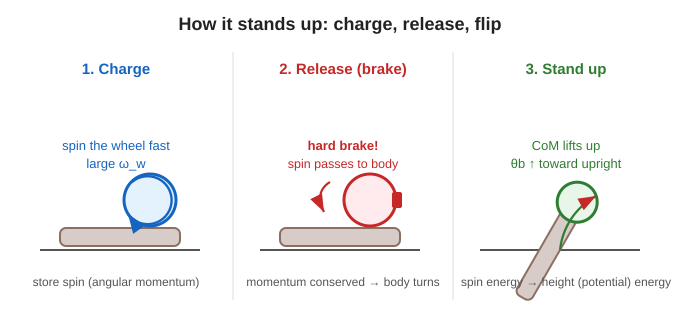

# 6. Physics of standing up (column)

> This page is an **advanced section** corresponding to the article’s column. We check with **equations** the phenomenon introduced in Session 1: “spin at high speed, then brake suddenly -> stand up.” You can read only the 🟢 part.

## How does it stand up from a lying position?

The control up to the previous page is for staying upright near the upright point. But to **stand up from the initial lying position**, a much larger force is needed. That is why the system uses the **“store, release, and rise”** strategy.

---

## 🟢 Easy: if you suddenly stop a spinning top, your hand feels a “thud”

1. **1) Store** … Use the motor to spin the wheel **at high speed**. Store rotational momentum (angular momentum).
2. **2) Release** … Use the brake to **stop it in an instant**. The stored momentum **moves to the body** (momentum does not disappear; it moves = conservation of angular momentum).
3. **3) Rise** … That momentum rotates the body, **lifts the center of mass**, and brings it to the upright point.

> 🧠 The point is not to “push slowly,” but to “**release the stored momentum all at once**.”
> That is why it can create a large force (the force needed to stand up) that the motor alone cannot produce.

---

## 🔵 In depth: check with angular momentum and energy

### Step 2: conservation of angular momentum (the instant of braking)
At the instant when the brake locks the wheel and body together, external torque can be ignored, so **angular momentum is conserved**.
The momentum $I_w\,\omega_w$ stored in the wheel transfers to the rotation $\omega_b$ of the combined whole (body + wheel) (article Eq. A).

$$ I_w\,\omega_w = \left(I_w + I_b + m_w l^2\right)\,\omega_b $$

- Left side: momentum stored in the wheel just before braking.
- Right side: momentum of the whole system just after braking, when it starts rotating.

### Step 3: conservation of energy (standing up)
When the **rotational kinetic energy** just after braking has exactly changed into **potential energy** that lifts the center of mass, the body can rise up to the angle $\theta_b$. From this balance, we can find the required wheel rotation speed $\omega_w$ (article Eq. C).

$$ \omega_w^2 = \frac{2\left(1-\cos\theta_b\right)\left(I_w + I_b + m_w l^2\right)\left(m_b l_b + m_w l\right) g}{I_w^{\,2}} $$

What we can read from it:

- The $(1-\cos\theta_b)$ on the right side … the more you want to **raise it by a large angle** (large $\theta_b$), the larger the required $\omega_w$ becomes.
- The larger $g$ or the masses are (= heavier and easier to fall), the larger the required $\omega_w$ becomes.
- The smaller $I_w$ is (a lighter wheel), the **higher rotation speed** is needed for the same effect.

> 🧠 This equation is a design equation for “**how much to spin the wheel before braking so it can stand up**.”
> From the wheel inertia $I_w$ and target angle $\theta_b$, you can calculate the required rotation speed backward.

### Why “all at once”? (review from Session 1)
The shorter the braking time $\Delta t$ is, the larger the released torque is:

$$ \tau_{\text{brake}} = \frac{\Delta L}{\Delta t} \;\gg\; \tau_{\text{motor}} $$

Even with the same momentum $\Delta L$, releasing it in a short time makes the instantaneous force large. That is why the electromagnetic brake stops it all at once.

---

### ✅ Quick check
- Can you say the three steps “store, release, and rise”? (easy)
- What is conserved at the instant of braking? (easy / 🔵)
- 🔵 From Eq. C, if the target angle $\theta_b$ becomes larger, what happens to the required $\omega_w$?
- 🔵 Why stop it “all at once” instead of “slowly”? (Explain with $\tau=\Delta L/\Delta t$.)

➡️ [Understanding check (quiz)](./quiz.md) ／ ⬅️ [Back to Lesson Session 2 top](./README.md)
