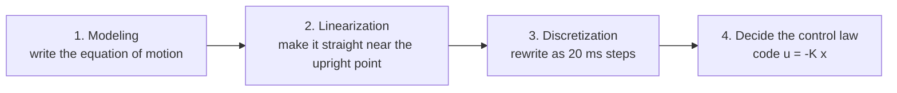

# Lesson Session 2: Equations of motion and microcontroller control ⚙️

In Session 1, we learned the **mechanism**: “when you spin a reaction wheel, the body rotates by the reaction.”
This time we go one step further. We follow **how the microcontroller calculates what to do so the body recovers instead of falling over**.

> **Original source for this session**: Transistor Gijutsu (Transistor Technology) July 2020, short serial Part 2, “Equations of motion and microcontroller control of a 1-D inverted pendulum” (Shinji Mitani / JAXA, pp.131–136). The figures are original redraws, not photos.

---

## 🎯 Goals for this session
- [ ] Say the **four steps** for making a microcontroller control program
- [ ] Explain what an “equation of motion (modeling)” represents
- [ ] Understand why “linearization” and “discretization” are needed
- [ ] Explain the idea of “state feedback (u = −Kx)”
- [ ] Explain why high-speed spinning -> sudden braking makes the body **stand up**, using momentum (angular momentum) and energy

---

## 🟢🔵 How to read these notes (two levels)
- **🟢 Easy** … Mostly analogies for middle school readers. Use this to get the flow without formulas.
- **🔵 In depth** … Uses equations of motion and matrices to explain why. If it feels difficult, reading only the 🧠 boxes is OK.

---

## 📖 Reading order

| No. | File | Content | In one phrase |
|---|---|---|---|
| 1 | [`01-development-flow.md`](./01-development-flow.md) | Four steps for making a control program | A cooking recipe |
| 2 | [`02-modeling.md`](./02-modeling.md) | Modeling = writing the equation of motion | Turning motion into rules |
| 3 | [`03-linearization.md`](./03-linearization.md) | Linearization = make it straight near the upright point | Turning a curve into a line |
| 4 | [`04-discretization.md`](./04-discretization.md) | Discretization = rewrite it as 20 ms steps | A flip-book animation |
| 5 | [`05-control-law.md`](./05-control-law.md) | Control law = decide u = −Kx | Decide how hard to push |
| 6 | [`06-standup-energy.md`](./06-standup-energy.md) | Physics of standing up (column) | Store, release, and rise |
| ✔️ | [`quiz.md`](./quiz.md) | Understanding check | Test your strength |

---

## 🧩 One-page summary for this session

The microcontroller control program is made with these **four steps**.

> 1) Turn the real motion into equations (modeling) -> 2) rewrite them into an easier form (linearization and discretization) -> 3) decide “how to move it” from those equations (control law).
> This order is the standard path for controlling many other robots and machines too.

---

## 💡 Keywords for this session (details in the text and [glossary](../GLOSSARY.md))
Equation of motion / modeling / moment of inertia / friction torque / linearization / Taylor expansion / equilibrium point (upright point) / state-space model / state variable / discretization / sampling period / state feedback / LQR / conservation of angular momentum

⬅️ Previous: [Lesson Session 1: Big picture and basic concepts](../session-1-overview/README.md) ／ Next time 👉 [Lesson Session 3: Extension to 3D](../session-3-3d/README.md)
