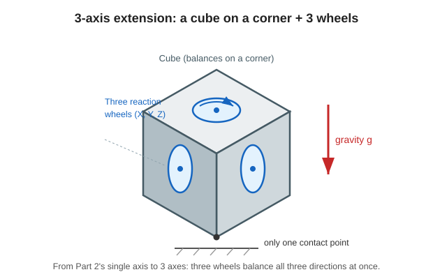

# 1. From 1 axis to 3 axes (what changes?)

Up through Session 2, we considered an inverted pendulum that moves **only around one axis**.
This time, we stand a cube on **one corner** and use three reaction wheels to recover it in **three directions at the same time**.



---

## Easy: spinning a plate on one finger grows into three directions

Balancing one spinning plate on your palm still feels possible, right?
But what if you had to balance **front-back, left-right, and twisting** directions **all at once**? The difficulty jumps suddenly.

- Stand the cube on **only one corner point** (one contact point).
- Put **three spinning tops (wheels)** inside, arranged at right angles to one another.
- Each spinning top recovers falling in the **direction it is responsible for**.

> The basic idea is the same as Session 2: if it tilts, push back the other way.
> But the three directions **affect each other**, so the troublesome part is added: “when you move one direction, another direction also moves a little.”

---

## In depth: what increases is “dimension” and “coupling”

### The standing attitude (upright point)
The target attitude is to stand the cube **on a corner**, with its diagonal pointing straight up. Written with pitch and roll, this attitude is

```math
\beta = \arctan\!\frac{1}{\sqrt{2}} \approx 35.26^\circ,\qquad \gamma = 45^\circ
```

This is a tilted point. It is the 3-D version of the **equilibrium point (upright point)**, corresponding to “standing at $`\theta_b=0`$” in Session 2.

### What increases?
| Session 2 (1 axis) | Session 3 (3 axes) |
|---|---|
| Three states (tilt, angular velocity, wheel speed) | **Nine states** ($`\mathbf{x}\in\mathbb{R}^9`$) |
| One wheel | **Three wheels** (X, Y, Z) |
| Tilt is one angle | Orientation is represented by **three Euler angles** |
| Straightforward 1-D equations | Terms from the **gyroscopic effect**, where rotations are coupled, are added |

> The biggest new point is that **the three directions are coupled**.
> To handle this mathematically, the next page prepares the tools called “coordinate frames” and “Euler angles.”

---

### Quick check
- Where is the cube standing? (How many contact points?) (easy)
- How many wheels are there, and why are there three? (easy)
- (In depth) How many dimensions does the state vector $`\mathbf{x}`$ have?
- (In depth) What is the newly added “coupling” effect in 3D called?

Next: [2. Coordinate frames and Euler angles](./02-frames-and-euler.md)
