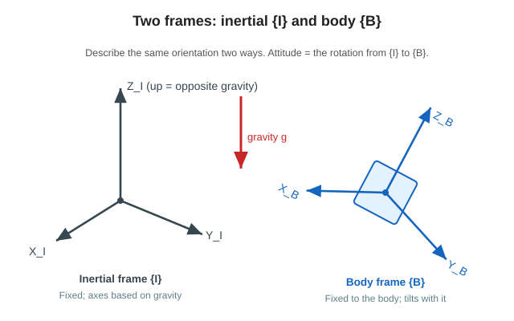
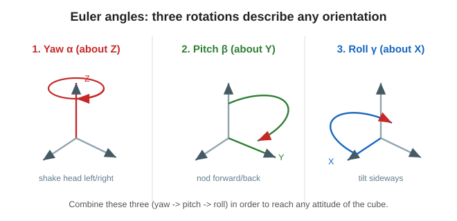

# 2. Coordinate frames and Euler angles (how to represent orientation)

To say exactly “which way it is facing now” in 3D, we need a **reference coordinate frame** and **angles that represent orientation**.
Here we prepare two coordinate frames and Euler angles (yaw, pitch, roll).



---

## 🟢 Easy: “the world map” and “your own direction”

When you get lost while traveling, there are two ways to look at direction.

- **The world map** (north, east, up) … a fixed reference shared by everyone.
- **Your own direction** (front, right, above your head) … rotates together with you.

Attitude control also switches between these two.

- **Inertial frame {I}** … the fixed reference. It takes the direction opposite gravity as “up” (= the world map).
- **Body frame {B}** … attached to the cube, so it tilts together with the cube (= your own direction).

> 🧠 **Attitude (orientation) means “how much {B} is rotated as seen from {I}.”**
> The next Euler angles represent this “amount of rotation” with three angles.



“Orientation” can represent any attitude by combining the following **three rotations**.

- **Yaw** (shaking your head left and right)
- **Pitch** (nodding your head forward and back)
- **Roll** (tilting your head sideways)

---

## 🔵 In depth: Euler angles and the upright point

The three angles that represent orientation are called **Euler angles** $`(\alpha,\beta,\gamma)`$ (the article uses rotations in XYZ order).

| Symbol | Name | Around which axis |
|---|---|---|
| $`\alpha`$ | Yaw | Around the Z axis |
| $`\beta`$ | Pitch | Around the Y axis |
| $`\gamma`$ | Roll | Around the X axis |

Multiplying these three rotations in order determines the **rotation** from {I} to {B}.
The upright point where the cube stands **on a corner** is the tilted attitude whose Euler angles are

```math
\beta = \arctan\!\frac{1}{\sqrt{2}} \approx 35.26^\circ,\qquad \gamma = 45^\circ
```

Control keeps correcting “small deviations” around this point (the same idea as linearization in Session 2).

> 🧠 Only yaw $`\alpha`$ later gets a special status: it is **unmeasurable and uncontrollable** (Pages 3 and 6).
> The reason is that twisting the cube around the vertical axis does not change how it looks from gravity.

---

### ✅ Quick check
- Which coordinate frames are “the world map” and “your own direction”? (easy)
- Try explaining yaw, pitch, and roll using head movements. (easy)
- 🔵 Attitude is what kind of thing from which coordinate frame to which coordinate frame?
- 🔵 About how many degrees is the pitch $`\beta`$ at the corner-standing upright point?

➡️ Next: [3. Measuring tilt with an accelerometer](./03-tilt-estimation.md)
