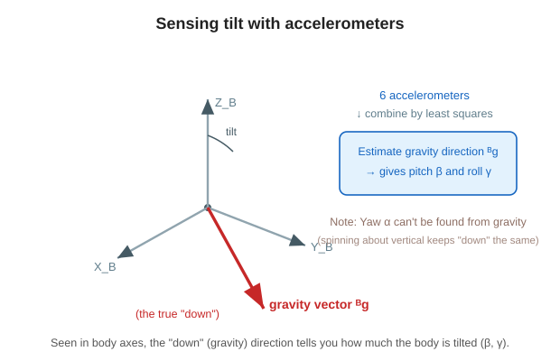

# 3. Measuring tilt with an accelerometer (which way is “down”?)

To control the cube, we first have to know **how much it is tilted right now**.
We find that tilt using an **accelerometer**.

---

## 🟢 Easy: an accelerometer is a tool that feels “down”

When it is still, an accelerometer is a tool that **feels gravity (downward)**.
A smartphone screen rotates when you tilt it because it detects “down” this way.

- If we know which way “down (gravity)” points as seen from the cube, we can calculate **how much it is tilted**.
- This cube uses **six** accelerometers to improve accuracy, and combines them to determine the “down direction.”

> 🧠 However, it can tell only **pitch and roll (front-back and left-right tilt)**.
> It **cannot tell yaw (twist around the vertical axis)**. That is because “down” does not change even if you spin it like a top.

---

## 🔵 In depth: gravity vector by least squares, then angles

Combining the outputs of the six accelerometers by **least squares** gives the **direction of gravity** $^{B}\hat{g}$ as seen from the body frame.
From its components, we get estimates of pitch and roll (article Eq. 36).

$$ \hat{\beta} = \operatorname{atan2}\!\big(-{}^{B}\hat{g}_x,\ \sqrt{{}^{B}\hat{g}_y{}^{2}+{}^{B}\hat{g}_z{}^{2}}\big) $$

$$ \hat{\gamma} = \operatorname{atan2}\!\big({}^{B}\hat{g}_y,\ {}^{B}\hat{g}_z\big) $$

- $\operatorname{atan2}$ is a function that gives an angle from the ratio of vertical and horizontal components (a version of $\arctan$ that also distinguishes signs properly).
- If the three components ($x,y,z$) of $^{B}\hat{g}$ are known, the equations above calculate pitch $\hat\beta$ and roll $\hat\gamma$.

### Why yaw cannot be obtained
Gravity only points “down,” so **rotating around the vertical axis (yaw axis) does not change $^{B}\hat{g}$**.
Therefore, yaw $\alpha$ **cannot be estimated from only the accelerometers (gravity)** (= it is not observable. This appears again on Page 6).

> 🧠 “Tilt (β and γ) can be found from gravity,” but “twist (α) cannot be found from gravity.”
> This asymmetry directly affects the later control design.

---

### ✅ Quick check
- What does an accelerometer feel when it is still? (easy)
- Why use as many as six accelerometers? (easy)
- 🔵 What function is used to get $\hat\beta,\hat\gamma$ from $^{B}\hat{g}$?
- 🔵 Why can yaw $\alpha$ not be found from gravity?

➡️ Next: [4. Combining with a complementary filter](./04-complementary-filter.md)
