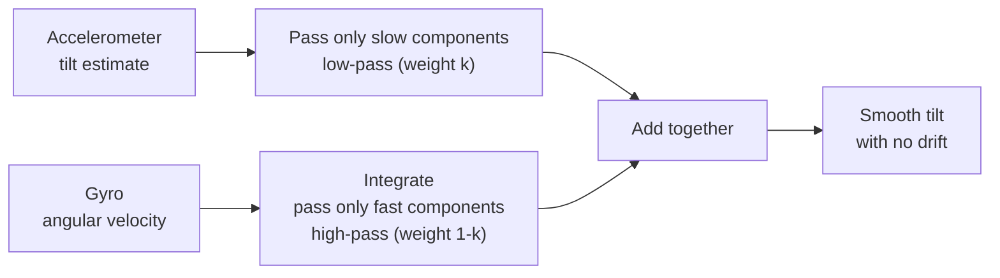

# 4. Combining with a complementary filter (taking the best parts)

There is actually one more way to measure tilt: a **gyro (angular velocity sensor)**.
Accelerometers and gyros have **opposite strengths and weaknesses**, so we use them together. The way to combine them is a **complementary filter**.

---

## 🟢 Easy: add the “strengths” of two sensors

| Sensor | Strength | Weakness |
|---|---|---|
| Accelerometer | **Accurate** in the long run (the average is correct) | **Weak** against shaking and vibration (instantaneous values wobble) |
| Gyro | **Strong** for instant motion (smooth) | Error **accumulates** over time (drift) |

- Accelerometer … Can tell the slow “true tilt,” but it jitters when shaken.
- Gyro … Smooth from moment to moment, but if left alone, it gradually drifts away.

If we **take the best parts** of these two, we get a tilt that is “smooth” and “does not drift.” That is the complementary filter.

> 🧠 The accelerometer’s “slow component” + the gyro’s “fast component” = just the right tilt.
> How much to trust each side is adjusted with one weight, $`\kappa`$ (kappa).



---

## 🔵 In depth: equation of the complementary filter

Using pitch $`\beta`$ estimation as an example, the complementary filter has this form (article Eq. 37):

```math
\bar{\beta}_k = \kappa\,\hat{\beta}_k + (1-\kappa)\big(\bar{\beta}_{k-1} + \dot{\hat{\beta}}_k\,\Delta t\big)
```

- $`\hat{\beta}_k`$ … Tilt from the **accelerometer** (the estimate from the previous page).
- $`\bar{\beta}_{k-1} + \dot{\hat{\beta}}_k\Delta t`$ … Tilt predicted as “previous value + current change” by integrating the **gyro** angular velocity.
- $`\kappa`$ ($`0\le\kappa\le1`$) … A **weight** for mixing the two.

| Value of $`\kappa`$ | Meaning |
|---|---|
| $`\kappa=1`$ | Trust only the accelerometer (ignore the gyro) |
| $`\kappa=0`$ | Trust only the gyro (ignore the accelerometer) |
| In between | Blend both (this is what is used in practice) |

In signal-processing words, the structure is: apply a **low-pass** filter to the accelerometer side (pass only slow components), apply a **high-pass** filter to the gyro side (pass only fast components), then add them together. Because the two filters **sum to 1** (they are complementary), it is called a “complementary filter.”

> 🧠 **Connection to Eq. 16**: $`\bar{\beta}_{k-1} + \dot{\hat{\beta}}_k\,\Delta t`$ is “previous value + angular velocity × time.” This is exactly the same **forward-Euler** “predict one step ahead” as the Session 2 discretization $`\mathbf{x}[k{+}1]\approx\mathbf{x}[k]+\Delta t\,\dot{\mathbf{x}}[k]`$ (Eq. 16). The same integration idea is at work inside the filter, too.

> 🧠 With one weight ($`\kappa`$), you adjust smoothness ⇄ response speed.
> It is lighter than a Kalman filter and runs easily on a microcontroller.

---

### ✅ Quick check
- What are the weaknesses of the accelerometer and gyro? (easy)
- “Taking the best parts” means combining what with what? (easy)
- 🔵 If $`\kappa=0`$, which sensor alone is used?
- 🔵 “Complementary (sums to 1)” describes the relationship between which two filters?

➡️ Next: [5. 3-D equations of motion (overview of the results)](./05-3d-equations.md)
