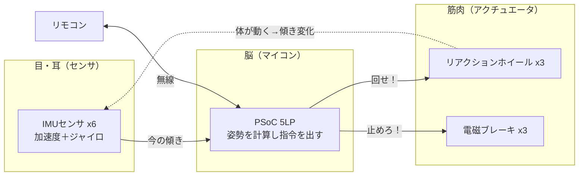

# リファレンス：作るために必要な情報 🔧

「実際に作るとき」に見返すための材料をまとめた場所です。
座学（＝理解する）とは分けて、**回路構成・部品・つなぎ方**を"逆引き"できるようにしています。

> 出典：トランジスタ技術 2020年6月号 短期連載「XYZ 3軸姿勢制御モジュールの運動方程式とマイコン制御」第1回（巳谷 真司／JAXA, pp.121–127）。図はすべて自分で描き直しています。

## 目次

| ファイル | 内容 | ひとことで |
|---|---|---|
| [`system-block.md`](./system-block.md) | 回路構成（システム・ブロック図） | **全体の配線図**：脳・目・筋肉のつながり |
| [`parts-list.md`](./parts-list.md) | 部品表（BOM） | **何が何個いるか**リスト |
| [`mechanical.md`](./mechanical.md) | メカ構造 | **ホイールとセンサの置き方** |
| [`interfaces.md`](./interfaces.md) | 信号インターフェース | **I²C / UART / D-A / MOSFET / パルスカウント** の役割 |

## 全体像（3つの部品グループで覚える）

この「**目で見て → 脳で考えて → 筋肉で動かす → また目で見る**」のループを、
1秒間に何百回もぐるぐる回すのが姿勢制御です（＝**フィードバック制御**）。

➡️ 配線の詳細は [`system-block.md`](./system-block.md) へ。
