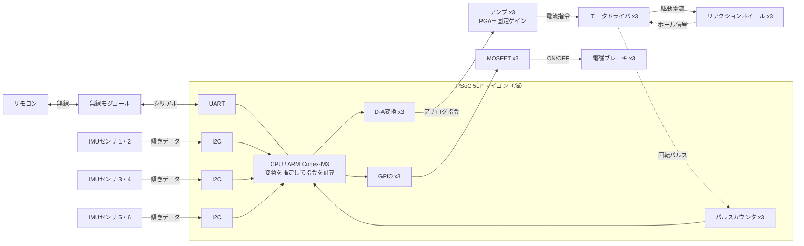
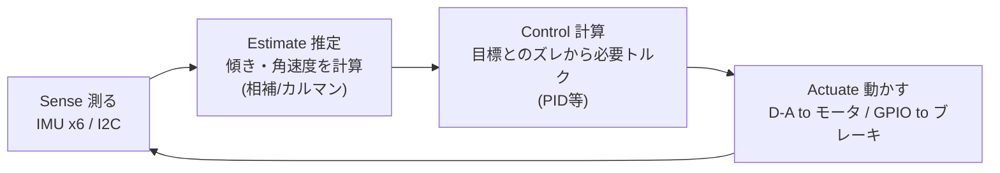

# 回路構成（システム・ブロック図）

元記事「図5 姿勢制御モジュールの制御システム」をもとに、自分で描き直して解説します。
**ほとんどの部品が PSoC 5LP マイコン1個に直接つながっている**のがポイントです（＝配線がシンプル）。

---

## 全体の配線図

> **x3 の意味**：ホイール・モータ・ドライバ・アンプ・ブレーキ・D-A・パルスカウンタは、**X軸／Y軸／Z軸ぶんで3セット**あります。
> 上の図では見やすさのため代表を1本にまとめています（実物は3チャンネル並列）。

---

## 信号の流れ（3つの道）

### ① 入力：センサ → 脳（「今どうなってる？」を知る）
- IMUセンサ6個が **I²C**（2本線のおしゃべり通信）でマイコンにデータを送る。
- 6個を2個ずつ、3本のI²Cに分けている（混雑を避けるため）。

### ② 出力・回す：脳 → モータ（「向きを変えろ」）
- マイコンは計算した指令を **D-Aコンバータ**でアナログ信号に変換して出力する。
- それを外付けの **アンプ（可変ゲインのPGA＋固定ゲイン）** で信号レベルを整え、**モータドライバ**へ渡す。
- モータドライバがモータへ**駆動電流**を流し、リアクションホイールが回る。
- ホイールの**回転数**は、モータドライバが出す**ホール・センサの信号**を **パルス・カウント回路** で数え、回転パルスとしてマイコンが読む（＝回しすぎ防止のための見張り）。

### ③ 出力・止める：脳 → ブレーキ（「一瞬で止めて大きな力を出せ」）
- マイコンが **GPIO** で **MOSFET**（電気スイッチ）をON。
- MOSFETが**電磁ブレーキ**に電気を流し、回っているホイールを一瞬で止める。
- この「急ブレーキ」で、ホイールの回転の勢いが**起き上がる力**に一気に変わる。

### ④ 通信：リモコン ⇄ 脳
- 手元のリモコン ⇄ 無線モジュール ⇄ **UART** ⇄ マイコン。
- 「起き上がれ」などの指令を人が送れる。

---

## なぜPSoC 5LPなのか（設計のねらい）

| 理由 | 中身 |
|---|---|
| リアルタイム性が命 | 制御の周期がブレると姿勢が不安定になる。→ **FreeRTOS**（リアルタイムOS）を採用。 |
| たくさんの仕事を同時に | センサ読み取り・通信・モータ駆動・制御計算…を1個でこなす必要がある。 |
| 回路をプログラムで作れる | PSoCの **UDB**（自由に組める回路ブロック）で、複数センサ／モータを柔軟につなげる。 |

---

## 🔵 くわしく：制御ループとタイミング

> 「配線（空間）」だけでなく「時間の流れ」を理解すると、なぜRTOSでこの構成なのかが腑に落ちます。

### 制御は「一定周期のループ」
姿勢制御は、次の4ステップを**決まった周期（例：数百Hz〜kHz）でひたすら繰り返す**フィードバック制御です。

- この1周の時間がバラつくと、計算した「必要トルク」と実際の効き方がズレて**不安定**になる。
- だから**時間の正確さ（リアルタイム性）**が命。**FreeRTOS**が「この処理は必ずこの周期で」を保証します。

### 「3チャンネル並列」という構造
- ホイール・モータ・ドライバ・アンプ・ブレーキ・D-A・パルスカウンタは **X/Y/Zで3セット**。3軸を**独立に**制御できる。
- I²Cが3本あるのは、MPU-6050のアドレスが2個しかない制約が理由（→ [`interfaces.md`](./interfaces.md)）。
  「センサ系のI²C 3本」と「アクチュエータ系の3セット」は**別々の3**である点に注意。

### なぜマイコン1個に集約？
- センサ読み・推定・制御計算・D-A出力・パルスカウント・通信を**同じ時間軸**で回すには、1個のチップで一括管理するのが確実。
- PSoCは **UDB**（自由に組める回路ブロック）で、D-Aやカウンタなどの周辺回路を必要な数だけ"生やせる"。だから3チャンネル×複数種類の入出力を1個でまかなえます。

---

## この回路が答える「作るときの問い」

- **何を測る？** → 傾き（IMU 6個 / I²C）
- **どう動かす？** → ホイールを回す（D-A→アンプ→ドライバ→モータ）＋止める（GPIO→MOSFET→電磁ブレーキ）
- **回しすぎない工夫は？** → 回転数をホール・センサ＋パルスカウントで読んで見張る
- **人はどう操作する？** → 無線→UART

📎 使う部品の一覧は [`parts-list.md`](./parts-list.md)、各通信の詳しい説明は [`interfaces.md`](./interfaces.md) へ。
