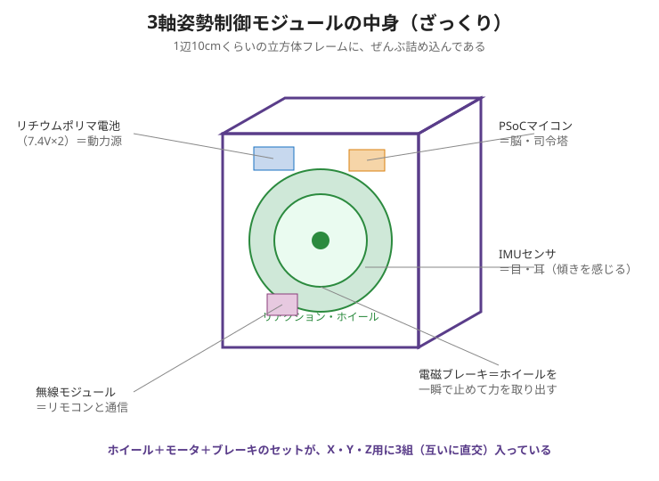
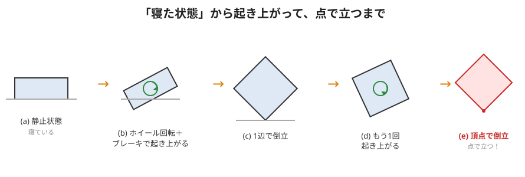

# 4. JAXAの3軸姿勢制御モジュールの紹介

いよいよ本体の紹介です。記事の主役はこれ👇

> **1辺 約10cm の立方体**の中に、姿勢制御に必要なものを**全部**詰め込んだ装置。
> 目的は **小型・軽量・高密度・低コスト**。人工衛星の「3軸制御」を**地上で実演**できる。

---

## この装置ができる「3つの技」

記事によると、次の3つの機能を持っています。

| 技 | 名前 | どんな動き | むずかしさ |
|---|---|---|---|
| ① | 辺による倒立 | **1本の辺**の上でバランスを取って立つ | 1次元倒立振子 |
| ② | 起き上がり | **寝た状態から自分で起き上がる**（この装置だけの特技） | — |
| ③ | 頂点による倒立 | **1つの点（頂点）**の上で立ち続ける | 3次元倒立振子 |

②は本物の人工衛星にはない、この教材だけの機能。
「瞬間的に大きな力を出せる**電磁ブレーキ**」があるからできる技です。

---

## 「点で立つ」ってどういうこと？（倒立振子）

**倒立振子（とうりつしんし）** ＝ **手のひらの上でほうきを立てる**遊びと同じ。
倒れそうな物を、下を細かく動かしてバランスを取り、立て続ける課題です。

この立方体は、頂点（点）で立つのがゴール。
点で立つのは超不安定 → でも、**3軸のホイールで「倒れる方向」を常に打ち消す**ことで立ち続けます。

上の図の流れ：
- **(a) 静止**：寝ている
- **(b) 起き上がり**：ホイールを回して急ブレーキ → その反動でグイッと起きる
- **(c) 1辺で倒立**：辺の上でバランス
- **(d) もう1回起き上がり**
- **(e) 頂点で倒立**：ついに点で立つ！🎉

---

## なぜ「立方体」で「3軸」なのか

- 立方体には**直交する3つの面**がある → そこにホイールを1枚ずつ、計3枚。
- 3枚が **X・Y・Z軸** を担当 → **どんな倒れ方にも対応**できる。
- すきまに電池や基板を詰めて、ムダなく小型化。

これがまさに **「3軸姿勢制御」** の実物。人工衛星が宇宙でやっていることの、地上ミニチュア版です。

---

## 🔵 くわしく：不安定な釣り合いと、起き上がりの物理

> 「点で立つ」と「起き上がる」が、なぜむずかしくて、なぜあの仕組みで実現できるのか。

### 「点で立つ」は"不安定な釣り合い"
- 谷底のボールは、少しずれても**戻ってくる**（安定な釣り合い）。
- 山頂や鉛筆の先で立つ状態は、少しでもずれると**どんどん倒れる**（不安定な釣り合い）。倒立振子はこちら側。
- 不安定な釣り合いは**放置では絶対に保てない**。だから**高速のフィードバック**（測る→直す）が必須で、ホイールが倒れる向きへ先回りしてトルクを出し続けます。

### 起き上がり：なぜ"急ブレーキ"が要るのか（数でイメージ）
寝た状態から重心を持ち上げるには、重力が引き戻そうとするトルクに打ち勝つ必要があります。傾き $\theta$ のとき重心にかかる重力トルクは、

$$ \tau_{\text{gravity}} = m\,g\,l\,\sin\theta $$

- 例：$m=1\,\text{kg}$、$g=9.8\,\text{m/s}^2$、$l=0.07\,\text{m}$、$\theta=45^\circ$ なら
  $\tau_{\text{gravity}} \approx 1 \times 9.8 \times 0.07 \times 0.707 \approx 0.48\,\text{N·m}$。
- モータの連続トルク（約 $0.055\,\text{N·m}$）の**約8〜9倍**。ゆっくり回すだけでは全然足りない。
- だから**高速回転でためた勢いを電磁ブレーキで一気に放出**し、瞬間的に大トルクを作る（→ 03の式 $\tau_{\text{brake}}=\Delta L/\Delta t$）。くわしい計算は座学3で。

> 🧠 まとめ：①点での倒立は不安定 → 高速フィードバックで維持。②起き上がりは重力トルクに勝つため、ブレーキの瞬間大トルクを使う。

---

### ✅ ミニ確認
- この装置の「3つの技」を言える？（やさしく）
- 倒立振子を、身近な遊びで例えると？（やさしく）
- なぜ立方体の形が3軸制御に都合がいいの？（やさしく）
- 🔵 「安定な釣り合い」と「不安定な釣り合い」のちがいを、ボールの例で説明してみよう。
- 🔵 なぜモータのゆっくり回転だけでは起き上がれないの？ 式を使って説明してみよう。

➡️ 次は [5. 部品のざっくり紹介](./05-parts-overview.md)
