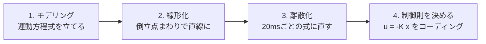

# 1. 制御プログラムづくりの4ステップ

## まず全体像：マイコンの中で何が起きている？

第1回の最後に見た**システム・ブロック図**を思い出してください。
センサ（目）→ マイコン（脳）→ モータドライバ（筋肉）→ ホイール、という流れでした。

このうち**マイコン（脳）の中身**、つまり「どう計算して立て直すか」を作るのが今回のテーマです。
そのプログラムは、次の**4ステップ**で組み立てます。

---

## やさしく：料理のレシピみたいなもの

いきなり「倒れない制御プログラム」を書くのはムリです。順番に準備します。

1. **モデリング（手順1）** … その物体が「どう動くか」のルールを式にする。
   → *材料と、火にかけたらどうなるかを知る段階。*
2. **線形化（手順2）** … ルールがちょっと複雑（曲線）なので、**倒立点の近くだけ**を考えて、まっすぐな式に直す。
   → *レシピを「ふつうの家庭のコンロ向け」に簡単化する段階。*
3. **離散化（手順3）** … マイコンは連続ではなく**20msごと**に動くので、式もその刻みに合わせて直す。
   → *「3分ごとにかき混ぜる」みたいに、時間をきざむ段階。*
4. **制御則を決める（手順4）** … 「今どれだけ傾いてるか」を見て「どれだけモータに電流を流すか」を決めるルールを作り、**プログラムに書く**。
   → *味を見て火加減を決める段階。*

> 大事なのは順番。**①動きを知る → ②③扱いやすく直す → ④どう動かすか決める**。
> この流れは倒立振子だけでなく、ロボットアームでもドローンでも同じです。

---

## くわしく：なぜこの4ステップなのか

- **手順1（モデリング）**：現実の運動を、ニュートンの法則から**運動方程式**（微分方程式）にします。これが制御の"設計図"。式が正しくないと、この先すべてがズレます。
- **手順2（線形化）**：運動方程式には $`\sin\theta_b`$ のような**非線形**な項が入ります。非線形のままだと設計理論（後で使うLQRなど）が使えないので、**倒立点まわりのテイラー展開**で1次までに近似し、**線形の状態空間モデル** $`\dot{\mathbf{x}} = A\mathbf{x} + Bu`$ にします。
- **手順3（離散化）**：マイコンは連続時間で積分できません。一定周期 $`\Delta t`$（ここでは $`20\,\text{ms}`$）ごとに更新する**離散時間モデル** $`\mathbf{x}[k+1] = A_d\mathbf{x}[k] + B_d u[k]`$ に変換します。
- **手順4（制御則）**：離散モデルに対して**状態フィードバック** $`u[k] = -K_d\,\mathbf{x}[k]`$ のゲイン $`K_d`$ を設計し、C言語などで実装します。

> ②〜③は「現実を、マイコンと制御理論が扱える形に翻訳する」作業。
> 難しさの多くは"翻訳"にあり、④の実装自体は数行の掛け算・足し算です。

---

### ミニ確認
- 制御プログラムづくりの4ステップを順番に言える？（やさしく）
- なぜ「線形化」と「離散化」が必要なの？（やさしく／）

次は [2. モデリング（運動方程式を立てる）](./02-modeling.md)
