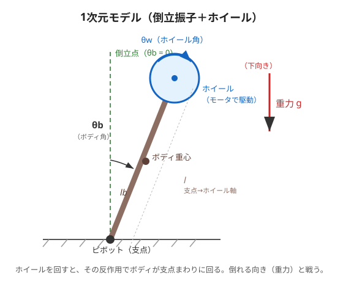

# 2. モデリング（運動方程式を立てる）

## 1次元モデルで考える

いきなり3次元は大変なので、第2回では**1次元（平面内で1軸だけ倒れる）**モデルで考えます。
これは「点で立てる棒（倒立振子）の先に、はずみ車（ホイール）が付いた」もの。



- **ボディ**（茶色の棒）… 支点（ピボット）で立とうとする本体。角度 $`\theta_b`$。
- **ホイール**（青い円）… モータで回す、はずみ車。角度 $`\theta_w`$。
- **倒立点**（緑の点線）… まっすぐ立った状態。$`\theta_b = 0`$。ここに保ちたい。
- **重力 g** … ボディを倒そうとする。

---

## 🟢 やさしく：登場する「力」は3つだけ

この棒が倒れたり立ったりするのを決めているのは、たった3つの力（はたらき）です。

1. **重力** … 傾くほど強く倒そうとする。（倒立点からズレるほど倒れやすい）
2. **モータの力（トルク）** … ホイールを回す。その反作用でボディを起こす向きにも効く。← 第1回の「回転いす」！
3. **摩擦** … 回転にブレーキをかける、じゃまもの。ボディの軸にも、ホイールの軸にもある。

> 🧠 モデリングとは、この「倒す力・起こす力・じゃまする力」の**つり合いを式1本にまとめる**ことです。
> 式にできれば、あとはマイコンが計算して「今どっちにどれだけ動くか」を予測できます。

---

## 🔵 くわしく：運動方程式

ニュートンの運動方程式（回転版：トルク＝慣性モーメント×角加速度）を、ボディとホイールそれぞれについて立てます。

**ホイールについて（記事の式9）**

```math
I_w\left(\ddot{\theta}_b + \ddot{\theta}_w\right) = T_m - C_w\,\dot{\theta}_w
```

**ボディについて（記事の式10）**

```math
\ddot{\theta}_b = \frac{(m_b l_b + m_w l)\,g\,\sin\theta_b \;-\; T_m \;-\; C_b\,\dot{\theta}_b \;+\; C_w\,\dot{\theta}_w}{I_b + m_w l^2}
```

記号の意味：

| 記号 | 意味 |
|---|---|
| $`\theta_b,\ \theta_w`$ | ボディ角・ホイール角 |
| $`I_b,\ I_w`$ | ボディ・ホイールの慣性モーメント（回しにくさ） |
| $`m_b,\ m_w`$ | ボディ・ホイールの質量 |
| $`l_b`$ | 支点からボディ重心までの距離 |
| $`l`$ | 支点からホイール軸までの距離 |
| $`C_b,\ C_w`$ | ボディ軸・ホイール軸の**摩擦（回転の粘性）係数** |
| $`T_m`$ | モータが出すトルク |
| $`g`$ | 重力加速度 |

**モータのトルク（記事の式12）** は、流す電流 $`u`$ に比例します。

```math
T_m = K_m\,u
```

- $`K_m`$：**トルク定数** [Nm/A]。電流1Aあたり何Nmのトルクが出るか（→ 用語集）。
- つまり**マイコンが操作できるのは電流 $`u`$ ひとつ**。これがこの後の"入力"になります。

> 🧠 分子を見ると、$`g\sin\theta_b`$ の項（重力で倒す）と、$`-T_m`$ の項（モータで起こす）が**引き算**で入っています。
> 「倒す力」と「起こす力」の綱引き。これを $`\theta_b=0`$ に保つのが制御のゴールです。

### なぜ $`\sin\theta_b`$ なのか
重力がボディを倒そうとする"ひねる力（トルク）"は、傾き $`\theta_b`$ が大きいほど強く、まっすぐ($`\theta_b=0`$)ならゼロ。この関係が $`\sin\theta_b`$ で表れます。この $`\sin`$ が、次のページで「じゃま」になります。

---

### ✅ ミニ確認
- この棒の動きを決める3つの「力」は何？（やさしく）
- 🔵 式(10)の分子で、「倒す向き」の項と「起こす向き」の項はどれ？
- 🔵 マイコンが直接いじれる量（入力）は何？ なぜ電流なの？

➡️ 次は [3. 線形化（曲線を直線に）](./03-linearization.md)
