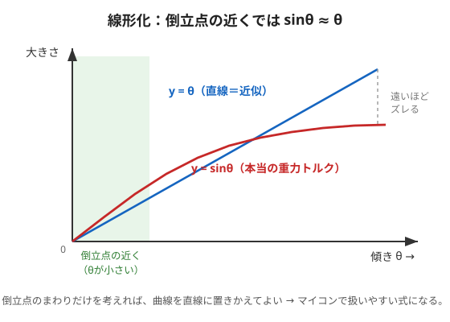

# 3. 線形化（曲線を直線に）

## 問題：$`\sin\theta_b`$ があると扱いにくい

前ページの運動方程式には $`\sin\theta_b`$ が入っていました。
この $`\sin`$（曲線）があると、あとで使う制御の設計理論がそのままでは使えません。
そこで**倒立点（$`\theta_b=0`$）の近くだけ**を考えて、曲線を**まっすぐな直線**に置きかえます。これが**線形化**です。



---

## 🟢 やさしく：近くだけ見れば、坂道はまっすぐ

地球は丸い（曲面）けれど、自分の足元だけ見れば地面は**平ら**に見えますよね。
それと同じで、**倒立点のすぐ近く**だけを考えれば、$`\sin`$ の曲線も**直線**とみなせます。

- 図の緑の帯（倒立点の近く、傾きが小さいところ）では、赤い曲線（本物）と青い直線（近似）がほぼ**ぴったり重なる**。
- でも倒立点から遠くなるほど、2つはズレていく。

> 🧠 だから、この制御は**「倒立点の近くで細かく直し続ける」ことが前提**。
> 大きく倒れた状態はこの式では正確に扱えません（そこは第2回コラムの"立ち上がり"で別に扱う）。

倒立点の近くでは、こう置きかえます：

```math
\sin\theta_b \;\approx\; \theta_b
```

（＝「曲線を直線に」。中学の"近似"のいちばん有名な例です。）

---

## 🔵 くわしく：テイラー展開と状態空間モデル

倒立点 $`\theta_b=0`$ まわりで**テイラー展開**し、2次以上の小さな項を捨てると、

```math
\sin\theta_b = \theta_b - \frac{\theta_b^3}{6} + \cdots \;\approx\; \theta_b
```

これで運動方程式が**線形**になります。次に、状態をまとめた**状態変数ベクトル**を用意します。

```math
\mathbf{x} = \begin{pmatrix} \theta_b \\ \dot{\theta}_b \\ \dot{\theta}_w \end{pmatrix} \quad(\text{ボディ角・ボディ角速度・ホイール角速度})
```

すると運動方程式は、次の**状態空間モデル**という形にまとまります（記事の式13）。

```math
\dot{\mathbf{x}} = A\,\mathbf{x} + B\,u
```

- $`A`$：**システム行列**（3×3）。物体そのものの動き方（放っておいたらどうなるか）を表す。
- $`B`$：**入力行列**。電流 $`u`$ がどう効くかを表す。
- $`A,\ B`$ の中身は部品の値（$`m,\ I,\ C,\ l`$ など）で決まります。ここでは**形（構造）だけ**押さえます。たとえば1行目は「$`\dot{\theta}_b`$ は状態の2番目そのもの」という当たり前の関係で、

```math
A \text{ の第1行} = \begin{pmatrix} 0 & 1 & 0 \end{pmatrix}
```

> 🧠 $`\dot{\mathbf{x}} = A\mathbf{x} + Bu`$ は「**今の状態 $`\mathbf{x}`$ と入力 $`u`$ が決まれば、次の瞬間の変化 $`\dot{\mathbf{x}}`$ が決まる**」という意味。
> この形にできると、安定性の判定やゲイン設計を**行列の計算だけ**で進められます。これが線形化のごほうび。

（$`A,\ B`$ の具体的な数値は部品が決まってから。ここでは「線形の状態空間モデルに直す」流れが分かれば十分です。）

---

### ✅ ミニ確認
- 「地球は丸いのに足元は平ら」は、何のたとえ？（やさしく）
- なぜ倒立点から遠いとこの近似はダメなの？（やさしく）
- 🔵 状態変数ベクトル $`\mathbf{x}`$ の3つの中身は？
- 🔵 $`\dot{\mathbf{x}} = A\mathbf{x} + Bu`$ の $`A`$ と $`B`$ は、それぞれ何を表す？

➡️ 次は [4. 離散化（20msごとの式に直す）](./04-discretization.md)
