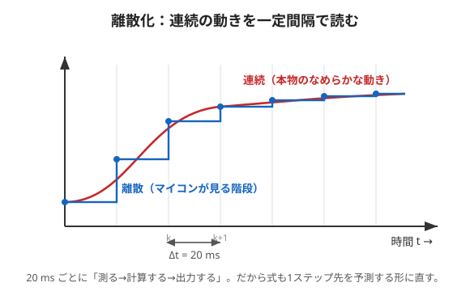

# 4. 離散化（20msごとの式に直す）

## 問題：マイコンは「連続」では計算できない

前ページの $`\dot{\mathbf{x}} = A\mathbf{x} + Bu`$ は**連続時間**の式（なめらかに流れる時間）。
でもマイコンは、一定の間隔で「測る→計算する→出力する」を**くり返す**だけ。
そこで、その刻み幅 $`\Delta t`$（ここでは **20 ms**）に合わせて式を作り直します。これが**離散化**です。



---

## やさしく：パラパラ漫画にする

なめらかなアニメも、実は**1枚1枚の絵（コマ）**でできています。
マイコンから見た世界も同じで、時間は**20msごとのコマ**でできている。

- 図の赤い曲線＝本物のなめらかな動き。
- 青い階段＝マイコンが見ている「20msごとのコマ」。
- マイコンは各コマで「今こうだから、**次のコマ**ではこうなる」と一歩先を予測します。

> 離散化とは、「連続の式」を「**1コマ先を予測する式**」に翻訳すること。
> $`k`$ 番目のコマの状態から、$`k{+}1`$ 番目を計算する形にします。

```math
\mathbf{x}[k{+}1] = A_d\,\mathbf{x}[k] + B_d\,u[k]
```

（$`[k]`$ は「$`k`$コマ目」の意味。次のコマ $`[k{+}1]`$ を予測している。）

---

## くわしく：離散化の式と、20msの妥当性

連続の $`A,\ B`$ から、離散の $`A_d,\ B_d`$ を作ります。いちばん簡単な近似（前進オイラー法）では、

```math
\mathbf{x}[k{+}1] = A_d\,\mathbf{x}[k] + B_d\,u[k] \qquad(\text{記事の式16})
```

```math
A_d = I_3 + \Delta t\,A, \qquad B_d = \Delta t\,B \qquad(\text{式17, 18})
```

- $`I_3`$：3×3の**単位行列**（対角が1、他は0）。
- $`\Delta t = 20\,\text{ms}`$：**サンプリング周期**。

### この形はどこから来るの？（前進オイラー）
むずかしくありません。「微分＝変化の速さ」の定義に戻るだけです。変化率 $`\dot{\mathbf x}`$ は、1コマ $`\Delta t`$ での差で近似できます：

```math
\dot{\mathbf x}\approx\frac{\mathbf x[k{+}1]-\mathbf x[k]}{\Delta t}\quad\Rightarrow\quad \mathbf x[k{+}1]\approx \mathbf x[k]+\Delta t\,\dot{\mathbf x}[k]
```

ここに連続の式 $`\dot{\mathbf x}=A\mathbf x+Bu`$ を入れると：

```math
\mathbf x[k{+}1]\approx \mathbf x[k]+\Delta t\,(A\mathbf x[k]+Bu[k]) = (I_3+\Delta t\,A)\,\mathbf x[k]+(\Delta t\,B)\,u[k]
```

見くらべれば $`A_d=I_3+\Delta t\,A`$、$`B_d=\Delta t\,B`$。これが式16〜18の正体です。

> これは一番素朴な近似（**前進オイラー法**）。厳密には $`A_d=e^{A\Delta t}`$（行列の指数）ですが、$`\Delta t`$ が十分小さければ、その1次分 $`I_3+\Delta t\,A`$ で足ります（テイラー展開の1次まで取ったもの）。

### なぜ 20 ms で足りるのか（安定性のチェック）
倒立振子は**放っておくと倒れる（不安定）**システムです。線形化したモデルの"不安定さ"は、行列 $`A`$ の**固有値**でわかります。この機体では不安定な固有値が

```math
\lambda \approx 11.57\ \ [1/\text{s}]
```

倒れ（発散）が目立ってくる時間の目安は $`2\pi/\lambda \approx 0.54\,\text{s} = 540\,\text{ms}`$ 程度。
サンプリングは $`20\,\text{ms}`$ なので、**倒れが進むより約27倍速くチェック・修正できる**ことになります。
→ $`20\,\text{ms}`$ は「倒れる前に十分間に合う」余裕のある周期、というわけです。

> 制御では「**現象より十分速くサンプリングする**」のが鉄則。
> 遅すぎると、コマとコマの間に倒れてしまい、直せません。

---

### ミニ確認
- 「パラパラ漫画」は何のたとえ？（やさしく）
- $`\Delta t`$（サンプリング周期）はいくつだった？（やさしく）
- （くわしく）$`A_d = I_3 + \Delta t\,A`$ の $`I_3`$ は何？
- （くわしく）なぜ 20 ms で「倒れる前に間に合う」と言えるの？

次は [5. 制御則（u = −Kx を決める）](./05-control-law.md)
