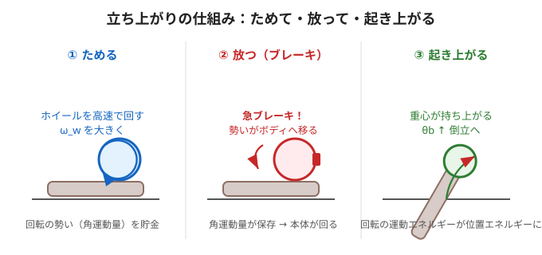

# 6. 立ち上がりの物理（コラム）

> このページは記事のコラムに対応する**発展編**。第1回で「高速で回して急ブレーキ→起き上がる」と紹介した現象を、**式で**確かめます。だけでも読めます。

## どうやって寝た状態から起き上がる？

倒立点の近くで立ち続けるのは前ページまでの制御。でも**最初に寝ている状態から立ち上がる**には、もっと大きな力が要ります。そこで使うのが**「ためて・放って・起き上がる」**作戦です。



---

## やさしく：コマを急に止めると手に「ガッ」とくる

1. **① ためる** … モータでホイールを**高速で回す**。回転の勢い（角運動量）をためこむ。
2. **② 放つ** … ブレーキで**一瞬で止める**。ためた勢いが**ボディへ移る**（勢いは消えず移動する＝角運動量保存）。
3. **③ 起き上がる** … その勢いでボディが回り、**重心が持ち上がって**倒立点へ。

> ポイントは「ゆっくり押す」のではなく「**ためた勢いを一気に放つ**」こと。
> だからモータ単体では出せない大きな力（起き上がるための力）を作れる。

---

## くわしく：角運動量とエネルギーで確かめる

### ステップ②：角運動量の保存（ブレーキの瞬間）
ブレーキでホイールとボディが一体化する瞬間、外からのトルクは無視できるので**角運動量が保存**します。
ホイールが持っていた勢い $`I_w\,\omega_w`$ が、一体になった全体（ボディ＋ホイール）の回転 $`\omega_b`$ に移ります（記事の式A）。

```math
I_w\,\omega_w = \left(I_w + I_b + m_w l^2\right)\,\omega_b
```

- 左辺：ブレーキ直前、ホイールがためていた勢い。
- 右辺：ブレーキ直後、全体が回りはじめる勢い。

### ステップ③：エネルギーの保存（起き上がり）
ブレーキ直後の**回転の運動エネルギー**が、重心を持ち上げる**位置エネルギー**にちょうど変わったとき、角度 $`\theta_b`$ まで起き上がれます。

回転の運動エネルギーは、第1回の**基礎式5** $`E=\tfrac12 I\omega^2`$ を全体 $`I_{\text{tot}}=I_w+I_b+m_w l^2`$ に当てはめたもの。これを、重心を角度 $`\theta_b`$ だけ持ち上げる位置エネルギーとつり合わせます：

```math
\tfrac12\,I_{\text{tot}}\,\omega_b^2 = \left(m_b l_b + m_w l\right) g\left(1-\cos\theta_b\right)
```

ここに、ステップ②の保存則（式A）から得た $`\omega_b = \dfrac{I_w\,\omega_w}{I_{\text{tot}}}`$ を代入します：

```math
\tfrac12\,I_{\text{tot}}\left(\frac{I_w\,\omega_w}{I_{\text{tot}}}\right)^2 = \left(m_b l_b + m_w l\right) g\left(1-\cos\theta_b\right)
```

$`\omega_w`$ について解くと、記事の**式C**になります（必要なホイール回転数）：

```math
\omega_w^2 = \frac{2\left(1-\cos\theta_b\right)\left(I_w + I_b + m_w l^2\right)\left(m_b l_b + m_w l\right) g}{I_w^{\,2}}
```

読み取れること：

- 右辺の $`(1-\cos\theta_b)`$ … **大きく起こしたい**（$`\theta_b`$ 大）ほど、必要な $`\omega_w`$ は大きい。
- $`g`$ や質量が大きい（＝重い・倒れやすい）ほど、必要な $`\omega_w`$ は大きい。
- $`I_w`$ が小さい（軽いホイール）ほど、同じ効果に**より高速な回転**が必要。

> この式は「**どれだけ回してからブレーキすれば起き上がれるか**」の設計式。
> ホイールの慣性 $`I_w`$・目標角 $`\theta_b`$ から、必要な回転数を逆算できます。

### なぜ「一気に」なのか（第1回の復習）
ブレーキ時間 $`\Delta t`$ が短いほど、放出トルクは大きい（第1回の**基礎式6** $`\tau=\Delta L/\Delta t`$）：

```math
\tau_{\text{brake}} = \frac{\Delta L}{\Delta t} \;\gg\; \tau_{\text{motor}}
```

同じ勢い $`\Delta L`$ でも、短時間で放てば瞬間の力は大きくなる。だから**電磁ブレーキ**で一気に止めるのです。

---

### ミニ確認
- 「ためて・放って・起き上がる」の3ステップを言える？（やさしく）
- ブレーキの瞬間に保存されるのは何？（やさしく／）
- （くわしく）式Cから、目標角 $`\theta_b`$ を大きくすると必要な $`\omega_w`$ はどうなる？
- （くわしく）なぜ「ゆっくり」ではなく「一気に」止めるの？（$`\tau=\Delta L/\Delta t`$ で説明）

[理解度チェック（quiz）](./quiz.md) ／ [座学2トップに戻る](./README.md)
