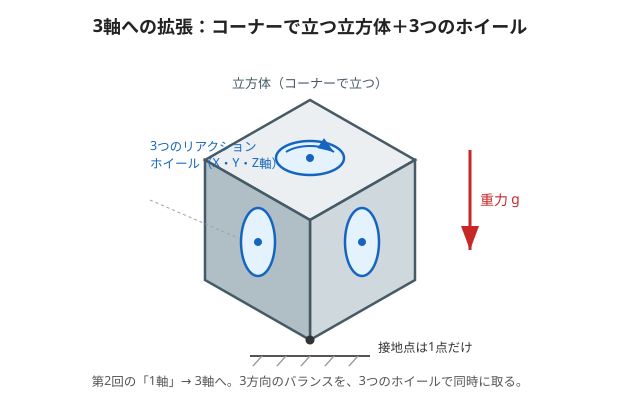

# 1. 1軸から3軸へ（何が変わる？）

第2回までは、**1本の軸のまわりだけ**を考える倒立振子でした。
今回は立方体を**コーナー（かど）1点で立たせ**、3つのリアクションホイールで**3方向を同時に**立て直します。



---

## やさしく：指1本のお皿回しが、3方向に増える

手のひらでお皿を1枚まわしてバランスを取るのは、まだできそうですよね。
では、**前後・左右・ひねり**の3方向を**同時に**バランスさせたらどうでしょう？　むずかしさが一気に上がります。

- 立方体を**かどの1点だけ**で立たせる（接地点は1点）。
- 中に**3つのコマ（ホイール）**を、たがいに直角の向きで積む。
- それぞれのコマが、**担当の方向**の倒れを立て直す。

> やることの考え方は第2回と同じ（傾いたら反対に押し返す）。
> でも3方向が**おたがいに影響し合う**ので、「1つ動かすと別の方向もちょっと動く」やっかいさが加わります。

---

## くわしく：増えるのは「次元」と「絡み合い」

### 立たせる姿勢（倒立点）
立方体を対角線が真上を向くように、**かどで立たせる**のが目標姿勢です。この姿勢はピッチ・ロールで表すと

```math
\beta = \arctan\!\frac{1}{\sqrt{2}} \approx 35.26^\circ,\qquad \gamma = 45^\circ
```

というかたむいた点。第2回の「$`\theta_b=0`$ で立つ」に相当する、3次元版の**平衡点（倒立点）**です。

### 何が増えるのか
| 第2回（1軸） | 第3回（3軸） |
|---|---|
| 状態は3つ（傾き・角速度・ホイール速度） | 状態は**9つ**（$`\mathbf{x}\in\mathbb{R}^9`$） |
| ホイール1個 | ホイール**3個**（X・Y・Z） |
| 傾きは1つの角 | 向きは**オイラー角3つ**で表す |
| 素直な1次元の式 | 回転が絡む**ジャイロ効果**の項が増える |

> いちばんの新しさは「**3方向が絡み合う**」こと。
> これを数学で扱うため、次のページからは「座標系」「オイラー角」という道具を用意します。

---

### ミニ確認
- 立方体はどこで立っている？（接地点はいくつ？）（やさしく）
- ホイールは何個で、なぜ3個なの？（やさしく）
- （くわしく）状態ベクトル $`\mathbf{x}`$ は何次元になった？
- （くわしく）3次元で新しく増える「絡み合い」の効果を何と呼ぶ？

次は [2. 座標系とオイラー角](./02-frames-and-euler.md)
