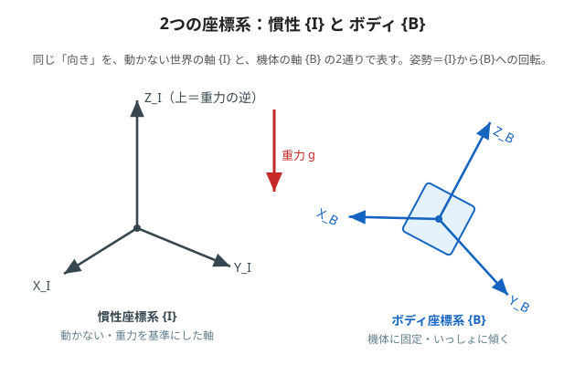
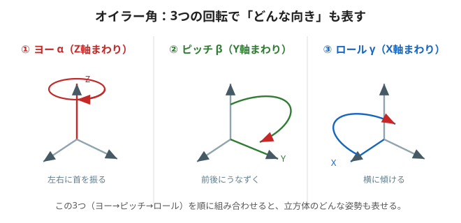

# 2. 座標系とオイラー角（向きの表し方）

3次元で「今どっちを向いているか」を正確に言うには、**基準になる座標系**と、**向きを表す角度**が必要です。
ここでは2つの座標系と、オイラー角（ヨー・ピッチ・ロール）を用意します。



---

## 🟢 やさしく：「世界の地図」と「自分の向き」

旅行で道に迷ったとき、2つの見方がありますよね。

- **世界の地図**（北・東・上）… 動かない、みんな共通の基準。
- **自分の向き**（前・右・頭の上）… 自分といっしょに回る。

姿勢制御でもこの2つを使い分けます。

- **慣性座標系 {I}** … 動かない基準。重力の逆向きを「上」にとる（＝世界の地図）。
- **ボディ座標系 {B}** … 立方体に貼りついていて、いっしょに傾く（＝自分の向き）。

> 🧠 **姿勢（向き）とは「{I} から見て {B} がどれだけ回っているか」**のこと。
> この「回り具合」を3つの角度で表すのが次のオイラー角です。



「向き」は、次の**3回の回転**の組み合わせで、どんな姿勢でも表せます。

- **ヨー**（首を左右にふる）
- **ピッチ**（首を前後にうなずく）
- **ロール**（首を横にかたむける）

---

## 🔵 くわしく：オイラー角と倒立点

向きを表す3つの角を**オイラー角** $`(\alpha,\beta,\gamma)`$ と呼びます（記事はXYZの順の回転を採用）。

| 記号 | 名前 | 何の軸まわり |
|---|---|---|
| $`\alpha`$ | ヨー（yaw） | Z 軸まわり |
| $`\beta`$ | ピッチ（pitch） | Y 軸まわり |
| $`\gamma`$ | ロール（roll） | X 軸まわり |

この3つを順番にかけ合わせると、{I} から {B} への**回転**が決まります。
立方体を**かどで立たせる**倒立点は、オイラー角でいうと

```math
\beta = \arctan\!\frac{1}{\sqrt{2}} \approx 35.26^\circ,\qquad \gamma = 45^\circ
```

というかたむいた姿勢。制御はこの点のまわりで「小さなズレ」を直し続けます（第2回の線形化と同じ発想）。

> 🧠 ヨー $`\alpha`$ だけは、あとで「**測れないし動かせない**」という特別な立場になります（3ページ目・6ページ目）。
> 理由は「立方体を縦軸まわりにひねっても、重力から見た姿は変わらない」から。

---

### ✅ ミニ確認
- 「世界の地図」と「自分の向き」は、それぞれどちらの座標系？（やさしく）
- ヨー・ピッチ・ロールを、首の動きで説明してみよう。（やさしく）
- 🔵 姿勢とは、どの座標系からどの座標系への何？
- 🔵 かどで立つ倒立点のピッチ $`\beta`$ はおよそ何度？

➡️ 次は [3. 加速度センサで傾きを測る](./03-tilt-estimation.md)
