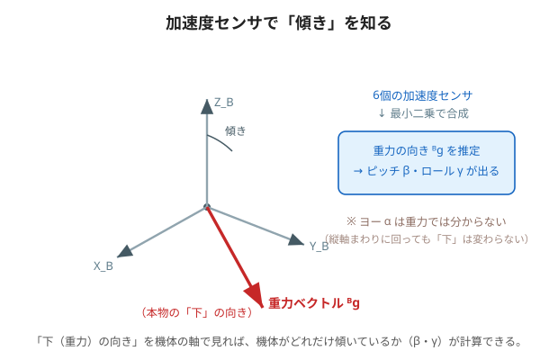

# 3. 加速度センサで傾きを測る（「下」はどっち）

制御するには、まず「**今どれだけ傾いているか**」を知らないといけません。
その傾きを、**加速度センサ**を使って求めます。



---

## 🟢 やさしく：加速度センサは「下」を感じる道具

加速度センサは、止まっているときは**重力（下向き）を感じる**道具です。
スマホを傾けると画面が回るのも、これで「下」を検出しているから。

- 立方体から見て「下（重力）」がどっちかが分かれば、**どれだけ傾いているか**が計算できる。
- この立方体では、精度を上げるために**6個**の加速度センサを使い、まとめて「下の向き」を割り出す。

> 🧠 ただし分かるのは**ピッチとロール（前後・左右の傾き）だけ**。
> **ヨー（縦軸まわりのひねり）は分からない**。コマのように回しても「下」は変わらないからです。

---

## 🔵 くわしく：最小二乗で重力ベクトル、そして角度へ

6個の加速度センサの出力を**最小二乗法**でまとめると、ボディ座標系から見た**重力の向き** $`^{B}\hat{g}`$ が求まります。
その成分から、ピッチ・ロールの推定値が出ます（記事の式36）。

```math
\hat{\beta} = \operatorname{atan2}\!\big(-{}^{B}\hat{g}_x,\ \sqrt{{}^{B}\hat{g}_y{}^{2}+{}^{B}\hat{g}_z{}^{2}}\big)
```

```math
\hat{\gamma} = \operatorname{atan2}\!\big({}^{B}\hat{g}_y,\ {}^{B}\hat{g}_z\big)
```

- $`\operatorname{atan2}`$ は「縦横の比から角度を出す」関数（符号までちゃんと区別できる版の $`\arctan`$）。
- $`^{B}\hat{g}`$ の3成分（$`x,y,z`$）が分かれば、上の式でピッチ $`\hat\beta`$・ロール $`\hat\gamma`$ が計算できる。

### ヨーが出せない理由
重力は「下」を指すだけなので、**縦軸（ヨー軸）まわりに回転しても $`^{B}\hat{g}`$ は変わりません**。
そのため、ヨー $`\alpha`$ は加速度センサ（重力）**だけでは推定できません**（＝可観測でない。6ページ目で再登場）。

> 🧠 「傾き（β・γ）は重力から分かる」「ひねり（α）は重力から分からない」。
> この非対称さが、あとの制御設計にそのまま効いてきます。

---

### ✅ ミニ確認
- 加速度センサは、止まっているとき何を感じている？（やさしく）
- 6個も使うのはなぜ？（やさしく）
- 🔵 $`^{B}\hat{g}`$ から $`\hat\beta,\hat\gamma`$ を出すのに使う関数は？
- 🔵 ヨー $`\alpha`$ が重力から分からないのはなぜ？

➡️ 次は [4. 相補フィルタで合成](./04-complementary-filter.md)
