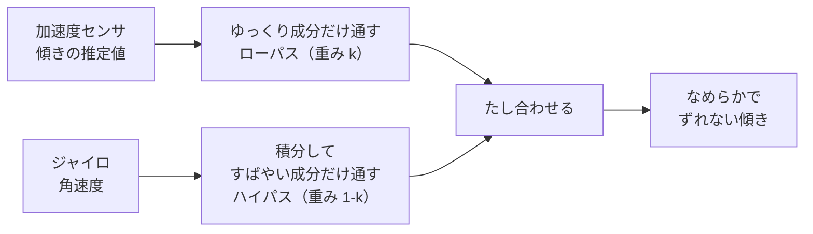

# 4. 相補フィルタで合成（いいとこ取り）

傾きの測り方は、実はもう1つあります。**ジャイロ（角速度センサ）**です。
加速度センサとジャイロは**得意・不得意が正反対**なので、2つを合わせて使います。その合わせ方が**相補フィルタ**です。

---

## 🟢 やさしく：2つのセンサの「得意」を足す

| センサ | 得意 | 不得意 |
|---|---|---|
| 加速度センサ | 長い目で見ると**正確**（平均は正しい） | 揺れ・振動に**弱い**（一瞬の値がブレる） |
| ジャイロ | 一瞬の動きに**強い**（なめらか） | 時間がたつと**ずれが積もる**（ドリフト） |

- 加速度センサ … ゆっくりした「本当の傾き」は分かるが、ガタガタ揺れる。
- ジャイロ … 一瞬一瞬はなめらかだが、放っておくとだんだんズレていく。

この2つを**いいとこ取り**すれば、「なめらか」で「ずれない」傾きが得られます。それが相補フィルタ。

> 🧠 加速度センサの「ゆっくり成分」＋ジャイロの「すばやい成分」＝ ちょうどいい傾き。
> どちらをどれだけ信じるかは、重み $\kappa$（カッパ）1つで調整します。

---

## 🔵 くわしく：相補フィルタの式

ピッチ $\beta$ の推定を例にすると、相補フィルタは次の形（記事の式37）：

$$ \bar{\beta}_k = \kappa\,\hat{\beta}_k + (1-\kappa)\big(\bar{\beta}_{k-1} + \dot{\hat{\beta}}_k\,\Delta t\big) $$

- $\hat{\beta}_k$ … **加速度センサ**から出した傾き（前ページの推定値）。
- $\bar{\beta}_{k-1} + \dot{\hat{\beta}}_k\Delta t$ … **ジャイロ**の角速度を積分して「前回＋今回の変化」で予測した傾き。
- $\kappa$（$0\le\kappa\le1$）… 2つをまぜる**重み**。

| $\kappa$ の値 | 意味 |
|---|---|
| $\kappa=1$ | 加速度センサだけを信じる（ジャイロ無視） |
| $\kappa=0$ | ジャイロだけを信じる（加速度センサ無視） |
| その間 | 両方をブレンド（実際はここを選ぶ） |

信号処理の言葉でいうと、**加速度センサ側にローパス**（ゆっくり成分だけ通す）、**ジャイロ側にハイパス**（すばやい成分だけ通す）をかけて足し合わせる、という構造になっています。2つのフィルタが**たすと1になる**（相補的）ので「相補フィルタ」と呼びます。

> 🧠 「重み1つ（$\kappa$）で、なめらかさ ⇄ 追従の速さ を調整」。
> カルマン・フィルタほど重くなく、マイコンで軽く動くのが利点です。

---

### ✅ ミニ確認
- 加速度センサとジャイロ、それぞれの弱点は？（やさしく）
- 「いいとこ取り」とは、何と何を合わせること？（やさしく）
- 🔵 $\kappa=0$ にすると、どちらのセンサだけになる？
- 🔵 「相補（たすと1）」とは、どの2つのフィルタの関係？

➡️ 次は [5. 3次元の運動方程式（結果の概観）](./05-3d-equations.md)
