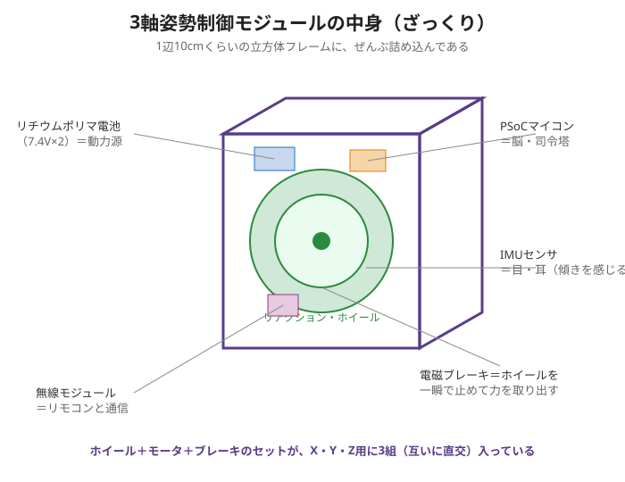
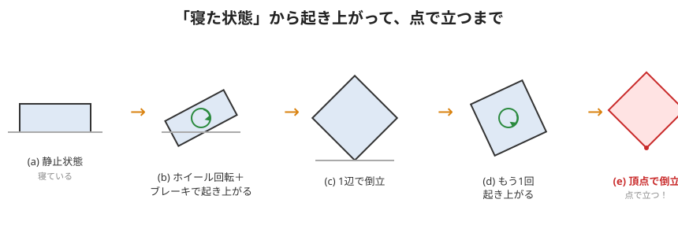

# メカ構造（部品の置き方）

元記事「図3 3軸姿勢制御モジュールのメカの構造」をもとに、**部品の並べ方**を説明します。
中身がぎゅうぎゅうに詰まっているのには、ちゃんと理由があります。



---

## 1. ホイールは「立方体の各面」に直交配置

- リアクションホイールは3枚。
- **立方体の3つの面**に、**互いに直角（直交）**になるように取り付ける。
- こうすると3枚が **X軸・Y軸・Z軸** をそれぞれ担当し、どんな向きの回転も作れる。

```
   Z(上下)
    │
    │
    └───── X(左右)
   ╱
  ╱
 Y(前後)
   ← ホイール3枚が、この3方向をそれぞれ担当
```

## 2. すきまに電子回路とバッテリを詰める

- ホイールとホイールの**すきま**に、基板・電池・センサを押し込む。
- 目的：**小型・軽量・高密度**（1辺10cmの中に全部入れる）。

## 3. IMUセンサは「わざと」バラして置く

- 6個のIMUを、立方体のあちこち（頂点付近など）に**分散**して取り付ける。
- 理由は2つ：
  1. **たくさんの値を平均**して誤差を減らす。
  2. **運動中心からズレた位置**に置くと、回転したとき**遠心力**を感じる。
     位置の違うセンサ同士を比べると、その差から動きをより正確に読める。
- （くわしい仕組みは座学2回目で）

---

## 起き上がり動作のイメージ



寝た状態(a)から、ホイールを回して急ブレーキ(b)→1辺で立つ(c)→もう一度(d)→**頂点（点）で倒立**(e)。
点で立ち続けられるのは、3軸のホイールで**倒れる方向を常に打ち消している**から。

📎 なぜ点で立てるのか（作用・反作用と倒立振子）は [座学1](../session-1-overview/README.md) と座学3で解説。
