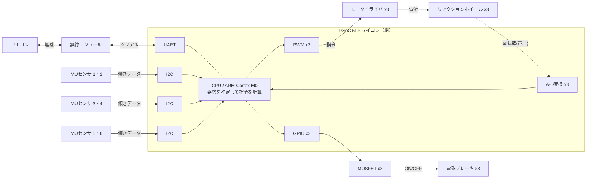

# 回路構成（システム・ブロック図）

元記事「図2 3軸姿勢制御モジュールのシステム・ブロック」を、自分で描き直して解説します。
**ほとんどの部品が PSoC 5LP マイコン1個に直接つながっている**のがポイントです（＝配線がシンプル）。

---

## 全体の配線図

> **x3 の意味**：ホイール・モータ・ブレーキ・PWM・A-Dは、**X軸／Y軸／Z軸ぶんで3セット**あります。
> 上の図では見やすさのため代表を1本にまとめています（実物は3チャンネル並列）。

---

## 信号の流れ（3つの道）

### ① 入力：センサ → 脳（「今どうなってる？」を知る）
- IMUセンサ6個が **I²C**（2本線のおしゃべり通信）でマイコンにデータを送る。
- 6個を2個ずつ、3本のI²Cに分けている（混雑を避けるため）。

### ② 出力・回す：脳 → モータ（「向きを変えろ」）
- マイコンが **PWM**（高速ON/OFF）で「どれくらい回すか」をモータドライバに指令。
- モータドライバがモータへ**電流**を流し、リアクションホイールが回る。
- ホイールの**回転数**は、モータドライバから**アナログ電圧**で返ってきて、**A-Dコンバータ**で数字に直してマイコンが読む（＝回しすぎ防止のための見張り）。

### ③ 出力・止める：脳 → ブレーキ（「一瞬で止めて大きな力を出せ」）
- マイコンが **GPIO** で **MOSFET**（電気スイッチ）をON。
- MOSFETが**電磁ブレーキ**に電気を流し、回っているホイールを一瞬で止める。
- この「急ブレーキ」で、ホイールの回転の勢いが**起き上がる力**に一気に変わる。

### ④ 通信：リモコン ⇄ 脳
- 手元のリモコン ⇄ 無線モジュール ⇄ **UART** ⇄ マイコン。
- 「起き上がれ」などの指令を人が送れる。

---

## なぜPSoC 5LPなのか（設計のねらい）

| 理由 | 中身 |
|---|---|
| リアルタイム性が命 | 制御の周期がブレると姿勢が不安定になる。→ **FreeRTOS**（リアルタイムOS）を採用。 |
| たくさんの仕事を同時に | センサ読み取り・通信・モータ駆動・制御計算…を1個でこなす必要がある。 |
| 回路をプログラムで作れる | PSoCの **UDB**（自由に組める回路ブロック）で、複数センサ／モータを柔軟につなげる。 |

---

## この回路が答える「作るときの問い」

- **何を測る？** → 傾き（IMU 6個 / I²C）
- **どう動かす？** → ホイールを回す（PWM→ドライバ→モータ）＋止める（GPIO→MOSFET→電磁ブレーキ）
- **回しすぎない工夫は？** → 回転数をA-Dで読んで見張る
- **人はどう操作する？** → 無線→UART

📎 使う部品の一覧は [`parts-list.md`](./parts-list.md)、各通信の詳しい説明は [`interfaces.md`](./interfaces.md) へ。
