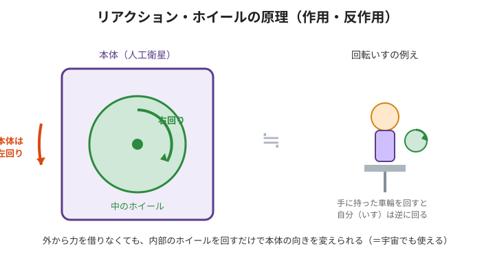

# 3. 宇宙で向きを変える方法（いちばん面白いところ）

## 疑問：宇宙では何も"つかまれない"

地上なら、向きを変えるのは簡単です。足で地面をけったり、手で壁を押したり。
でも宇宙は**真空で、つかまる地面も壁もありません**。

では、どうやって向きを変える？ 方法は大きく2つあります。

---

## 方法A：ガスを噴く（スラスタ / RCS）

ロケットのように**ガスを噴射**して、その反動で向きを変えます。
- ✅ 強い力が出せる
- ❌ ガス（燃料）を使い切ったら終わり。小さな装置には向かない。

---

## 方法B：中で"はずみ車"を回す（リアクションホイール）⭐️

こっちが今回の主役。**燃料がいらない**魔法のような方法です。

### 回転いすで実験してみよう
回る椅子に座って、重い車輪（やダンベル）を手に持ち、**車輪を右に回す**と…
あなた（と椅子）は**左に回り**ます。不思議ですよね。

これは魔法ではなく、**物理の法則**です。

### カギは「角運動量（回りの勢い）は勝手に増減しない」

- **角運動量** ＝ 「回転の勢い」。重くて速く回るほど大きい。
- 外から力が加わらなければ、**全体の回りの勢いの合計は変わらない**（＝**角運動量保存則**）。

最初は誰も回っていない（勢いの合計＝ゼロ）。
そこで**ホイールを右に回す**と、勢いの合計をゼロに保つため、
**本体は左に回る**（プラスとマイナスで打ち消し合う）。

> 🧠 つまり：**中のホイールを回すだけで、外の力を借りずに本体の向きを変えられる。**
> 宇宙船にぴったり！

---

## 「回す」と「止める」の合わせ技

JAXAのモジュールがすごいのは、**電磁ブレーキ**も持っていること。

- モータでホイールをゆっくり回すだけだと、出せる力は弱い。
- そこで **高速で回しておいて、電磁ブレーキで一瞬で止める**。
- すると、ためこんだ回転の勢いが **どかん！と一気に力（トルク）に変わり**、
  重力に打ち勝って**寝た状態から起き上がれる**ほどの力が出せる。

> 例え：おもちゃのコマを思いっきり回してから、指で急に止めると「ガッ」と手に反動がきますよね。あの反動を利用するイメージ。

---

## ちょっとした弱点：アンローディング

ホイールを同じ向きに回し続けると、いつか**回転が速くなりすぎて限界**に達します（もう加速できない）。
そのときは、別の手段で本体に力をかけて**ホイールの回転を元に戻す**必要があります。
これを **アンローディング（unloading）** と呼びます。（座学3でくわしく）

---

### ✅ ミニ確認
- スラスタとリアクションホイール、それぞれの長所・短所は？
- 「角運動量保存則」を回転いすの例で説明してみよう。
- なぜ電磁ブレーキを使うと大きな力が出せるの？

➡️ 次は [4. JAXAモジュールの紹介](./04-jaxa-module.md)
