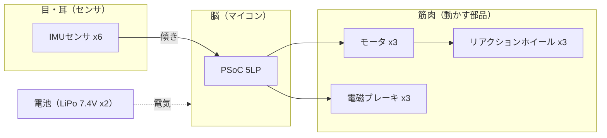

# 5. 部品のざっくり紹介（目・脳・筋肉）

装置の中身はたくさんの部品でできていますが、
**「目・脳・筋肉」** の3グループに分けると、一気にわかりやすくなります。



---

## 👀 目・耳：センサ

| 部品 | 役割 | ひとこと |
|---|---|---|
| **IMUセンサ ×6** | 傾き・動きを感じる | 「加速度センサ」＋「ジャイロ」のセット。6個で正確に。 |

- **加速度センサ**：どっちが下（重力）かを感じる。→ ゆっくりの傾きが得意。
- **ジャイロ**：回っているスピードを感じる。→ 素早い動きが得意。
- 2つを合体させると、遅い動きも速い動きも正確にわかる（→座学2の主役）。

## 🧠 脳：マイコン

| 部品 | 役割 | ひとこと |
|---|---|---|
| **PSoC 5LP** | 全体の司令塔 | センサを読み、計算し、モータへ指令。回路をプログラムで作れるのが特徴。 |

- 姿勢制御は**時間が命**なので、**リアルタイムOS（FreeRTOS）**で正確なリズムを刻む。

## 💪 筋肉：動かす部品（アクチュエータ）

| 部品 | 役割 | ひとこと |
|---|---|---|
| **モータ ×3** | ホイールを回す | maxonのブラシレスモータ（30W）。 |
| **リアクションホイール ×3** | 回って本体の向きを変える | X/Y/Z の3軸ぶん。 |
| **電磁ブレーキ ×3** | 一瞬で止めて大きな力を出す | 「起き上がり」の必殺技。 |

## 🔌 その他

| 部品 | 役割 |
|---|---|
| **無線モジュール** | 手元のリモコンと通信 |
| **リチウムポリマ電池 ×2** | 電気の供給源（7.4V×2） |
| **立方体フレーム** | 全部を収める骨組み（1辺約10cm） |

---

## まとめ：この章の地図

```
👀 目（IMU×6） → 🧠 脳（PSoC） → 💪 筋肉（モータ→ホイール／ブレーキ）×3軸
                     ↑______________ また目で確認（くり返し）
```

- **座学2** では 👀「目」＝センサをくわしく（自分の傾きを"知る"）
- **座学3** では 💪「筋肉」＝ホイール・ブレーキ・モータと制御をくわしく（"動かす"）

作るときの詳しい部品情報は [`reference/parts-list.md`](../reference/parts-list.md)、
配線は [`reference/system-block.md`](../reference/system-block.md) にまとめてあります。

---

### ✅ ミニ確認
- 部品を「目・脳・筋肉」に分けてみよう。
- 加速度センサとジャイロ、それぞれ何が得意？
- なぜ多くの部品が「×3」あるの？

➡️ 力だめし！ [`quiz.md`](./quiz.md)
