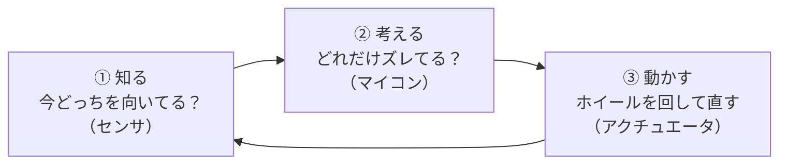
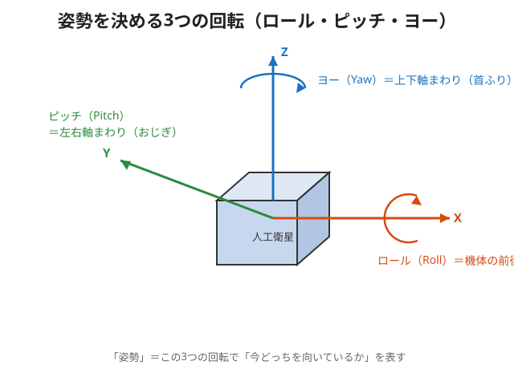

# 座学 第1回：全体像と基礎概念 🛰️

ようこそ！ここでは **「3軸姿勢制御ってそもそも何？」** を、むずかしい数式なしで、
イメージ（例え）を中心に理解します。今回のゴールはこれ👇

## 🎯 今回のゴール
- [ ] 「姿勢」と「3軸（XYZ）」が何かを説明できる
- [ ] 人工衛星が姿勢制御を必要とする理由を言える
- [ ] 宇宙で（何もつかまるものがなくても）向きを変える方法がわかる
- [ ] JAXAの3軸姿勢制御モジュールが何をするものか説明できる
- [ ] モジュールの部品を「目・脳・筋肉」に分けて言える

---

## 📖 読む順番

| No. | ファイル | 内容 | 例えるなら |
|---|---|---|---|
| 1 | [`01-what-is-attitude.md`](./01-what-is-attitude.md) | 姿勢とXYZ軸・ロール/ピッチ/ヨー | 「向き」を数で表す |
| 2 | [`02-why-needed.md`](./02-why-needed.md) | なぜ姿勢制御が必要か | アンテナ・太陽・カメラを向ける |
| 3 | [`03-how-to-turn-in-space.md`](./03-how-to-turn-in-space.md) | 宇宙で向きを変える方法 | 回転いすの魔法 |
| 4 | [`04-jaxa-module.md`](./04-jaxa-module.md) | JAXAモジュールの紹介 | 点で立つ立方体 |
| 5 | [`05-parts-overview.md`](./05-parts-overview.md) | 部品のざっくり紹介 | 目・脳・筋肉 |
| ✔️ | [`quiz.md`](./quiz.md) | 理解度チェック | 力だめし |

---

## 🧩 今回の一枚まとめ

姿勢制御は、この3ステップの**くり返し**です。

> このループを1秒に何百回も回して、倒れる前に少しずつ直し続ける。
> だから、細い点の上でも立っていられる。

---

## 💡 今回のキーワード（詳しくは本文と [用語集](../GLOSSARY.md)）
姿勢 / 3軸 / ロール・ピッチ・ヨー / トルク / 慣性 / リアクションホイール / 角運動量 / 倒立振子

次回予告 👉 [座学2：センサと姿勢推定](../session-2-sensing/README.md)（自分の傾きを"知る"仕組み）
